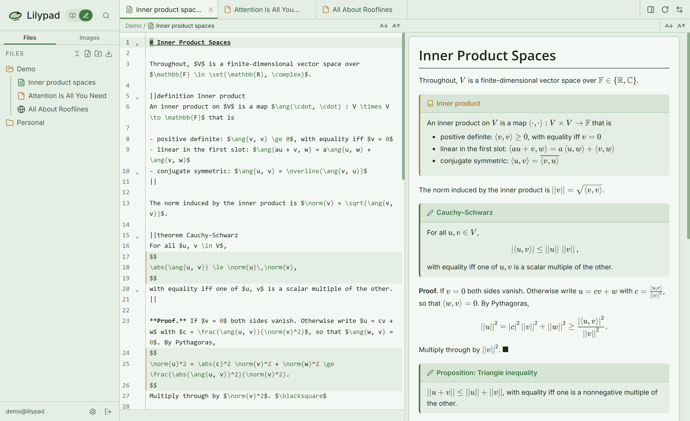
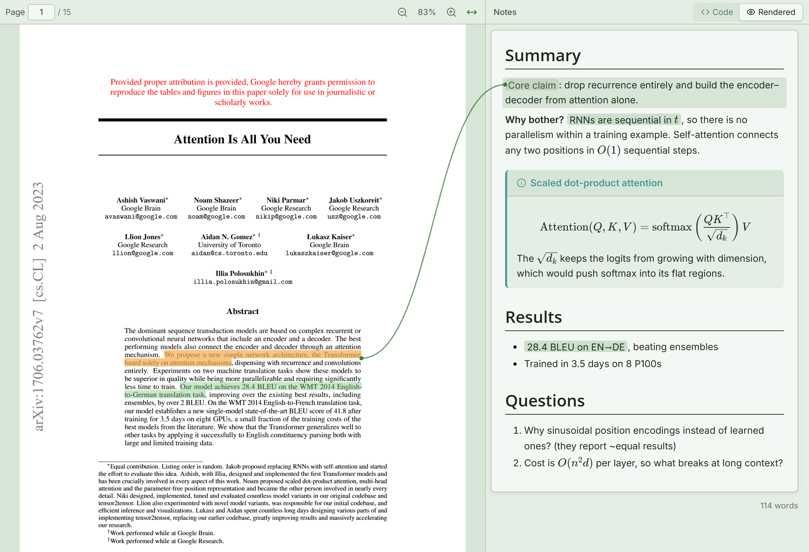
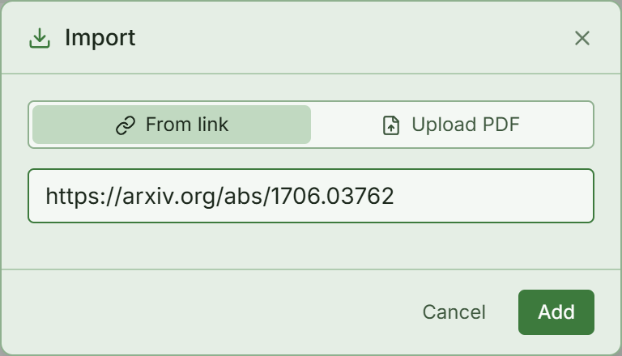
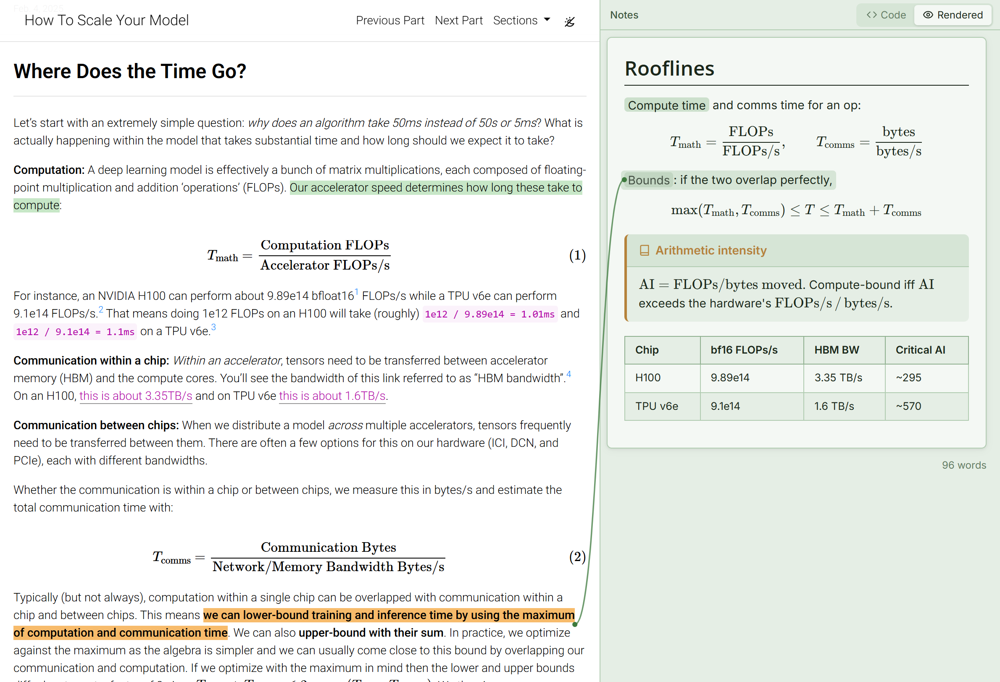
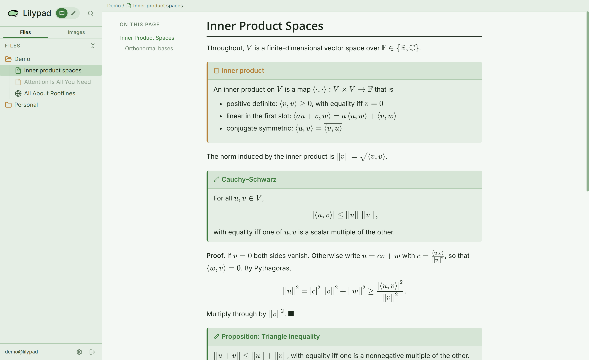
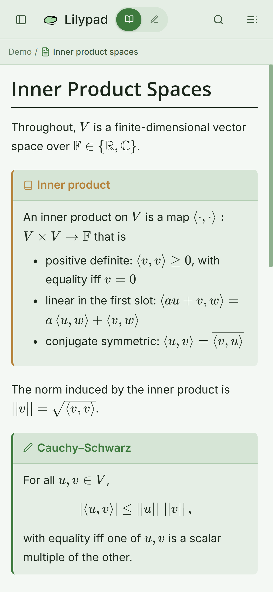
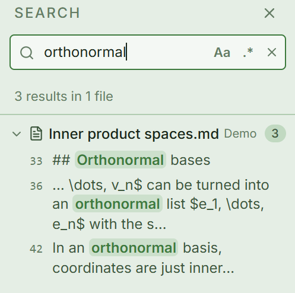

# Lilypad



Lilypad is a note-taking app based on Markdown with support for:
- LaTeX
- Adomonitions
- Annotating website captures
- Annotating PDFs
- Images with tags for specifying size

Built with Vue 3 and Supabase and live at [lilypad.rcya1.dev](https://lilypad.rcya1.dev)

Most of the UI + shortcuts + markdown styling are customized
for my preferences. The original project [lilypad-v1](https://github.com/rcya1/lilypad-v1) was built for typing my college notes using a custom Markdown parser and a VScode extension to preview changes. This version (v2) was built on top of the same custom markdown parser but is a full web app rather and is mostly vibe-coded using Claude Code.

## What it does

**Notes.** Notes are Markdown files edited in CodeMirror, with a live preview beside the editor.
Vim keybindings are on by default and can be configured or turned off in Settings. The preview
renders math with KaTeX and adds a few extensions of its own:

```markdown
Inline $\abs{x} < \vare$ and display math:

$$
\norm{f}_2 = \paren{\int \abs{f}^2}^{1/2}
$$

||theorem Cauchy–Schwarz
$\abs{\ang{u, v}} \le \norm{u}\,\norm{v}$
||

{w-1/2}
```

- Admonition blocks can be used to render info panels, definitions, theorems, etc.
- A set of LaTeX macros is built in (`\abs`, `\norm`, `\set`, `\ang`, `\floor`, ...). See the top
  of `src/lib/markdown.ts` for a list of all of them.
- Images are uploaded to the server with per-user permissioning.


**PDFs.** You can upload a PDF or import one from a URL. Highlight text and then add links to it
in the notes pane to the right.



Highlights come in four colours. In the notes, `[text](lily:hl-1)` links to a highlight; hovering
the link draws a line to it, and clicking it scrolls the PDF there. 



**Web pages.** Any other URL is captured by headless Chromium and stored as a static HTML
snapshot with its scripts removed. Highlights and notes work the same way as for PDFs.



**Reading mode.** A separate `/read` view lays out notes for reading rather than editing. It has a
table of contents and supports mobile.



It also supports mobile!



**Offline.** The app is a PWA. Notes, the file tree and anything you've opened are cached in
IndexedDB, and edits made offline are queued. When the device reconnects conflicting note wrotes are
three-way merged with Git-style merge conflict resolution.

**Text search.** Search for specific occurrences of text across the notes using a client-side trigram
index.



**Quick switcher.** Press Ctrl/Cmd+P for a VSCode-inspired quick switcher.

## Running it locally

You need Node 22.17+, Yarn, and a Supabase project.

```sh
yarn
npx playwright install chromium   # only needed for web page capture in dev
```

Create `.env.local`:

```sh
VITE_SUPABASE_URL=https://<project>.supabase.co
VITE_SUPABASE_ANON_KEY=<anon key>
```

Then `yarn dev` to run the server.

Run `supabase/schema.sql` in the Supabase SQL editor.

Follow a guide to enable Google and/or GitHub authentication in the Supabase project.

## Scripts

| Command           | What it does                                     |
| ----------------- | ------------------------------------------------ |
| `yarn dev`        | Vite dev server, including the dev API endpoints |
| `yarn build`      | Type-check and production build                  |
| `yarn test`       | Vitest unit tests                                |
| `yarn type-check` | `vue-tsc` only                                   |
| `yarn lint`       | oxlint, then ESLint (both with `--fix`)          |
| `yarn format`     | Prettier over `src/`                             |

## Layout

```
api/            Vercel functions: capture.ts, fetch-pdf.ts
tools/          The capture and PDF-fetch logic itself, shared by api/ and the dev server
src/
  components/   editor/, reader/, sidebar/, settings/, auth/, ui/
  stores/       Pinia: files, editor, annotations, sync, search, ui, auth, toast
  lib/          Framework-free logic: markdown, merge, offline, text/PDF anchors, trigram search
  types/        Shared types, including the Supabase schema
```
