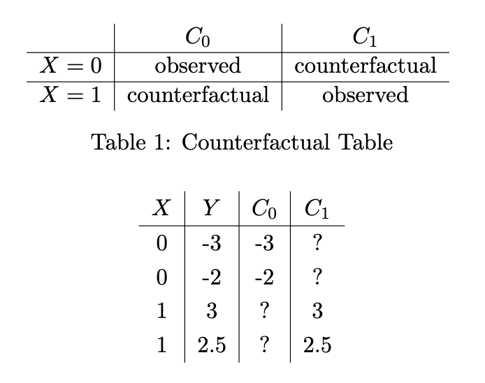

## Causal Inference

A linear relationship between $X$ and $Y$ does not imply causation

Causation implies:

- Changing $X$ necessarily changes $Y$
- Typically a time component, so the change in $X$ has to occur before the change in $Y$

### Counterfactual Model

Let $X \in \{0, 1\}$ be a random variable denoting whether or not a treatment was applied

- $X = 0$ is the "control"
- $Y \in \reals$ is the response, which is typically a binary response but really could be any real

We define $C_0$ and $C_1$ to be the potential outcomes, i.e. the potential values of $Y$ in the case that $X = 0$ or $X = 1$

- These are random variables
- $Y = C_X$
- When $X = 0$, $C_0$ is the observed, and $C_1$ is the counterfactual. Vice versa for when $X = 1$

||definition Average Treatment Effect
$\theta = \exp{C_1} - \exp{C_0}$
||

- Generally, we do want to find the ATE, but it is not computable directly because we don't know the counterfactual for each observation

||definition Association
$\alpha = \exp{Y | X = 1} - \exp{Y | X = 0}$
||

- We can estimate this directly through the plugin estimator

In general, these are not equal to each other due to the idea of confounding variables

- Consider the example where we have $Z \sim \text{Unif}([-1, 1])$ and let $X = 1(Z > 0)$
- We let $C_0 = C_1 = Z$
  - Clearly, the treatment has no effect, and we get that $\theta = \exp{C_1} - \exp{C_0} = 0$
  - However, $\alpha = \exp{Y | X = 1} - \exp{Y | X = 0} = 1/2 - -1/2 = 1$
- $Z$ is a confounding variable that impacts both $X$ and $Y$
  - An example of another confounding variable is the decision to give someone a treatment or not based on their current health

### Estimating ATE with Association

- We can design an experiment to guarantee $\theta = \alpha$
  - Known as randomized controlled trials, or A/B testing
  - This is done by determining who gets which treatment entirely by a random coin
    - This can be unethical, i.e. denying someone with a medical condition a treatment based on a flipped coin
- As long as $X$ is a pure Bernoulli random variable, then we guarantee that $\alpha = \theta$
  - This is because $C_0$ and $C_1$ are independent of $X$

---

- Often, we use observational studies where the outcomes are not independent of $X$
  - However, we might be able to find a feature vector $Z$ such that $C_0, C_1$ are independent of $X$ conditioned on $Z$
    - I.e. in a treatment, we could have $Z$ be a vector of all of your health conditions
  - We could then split up our observations based on the value of $Z$, and for each of these, we would have that $\theta = \alpha$
- However, this is hard to do when $Z$ is high-dimensional
  - You would have to create bins for each $Z$, but then each bin would only have a small number of observations
  - We want to somehow reduce $Z$ to a single number, which is much easier to bin up

||definition Propensity Score
$$p(z) = P(X = 1 | Z = z)$$
||

- If we calculate this for each $Z$ value and then bin them up then we can apply the following theorem:

||theorem Rosenbaum and Rubin
If $C_i$ is strongly unconfound with $X$ given $Z$, then it is also strongly unconfound with $X$ given $p(Z)$
||

Typically, we can't compute $p(z)$ directly, but we could learn it via logistic regression
