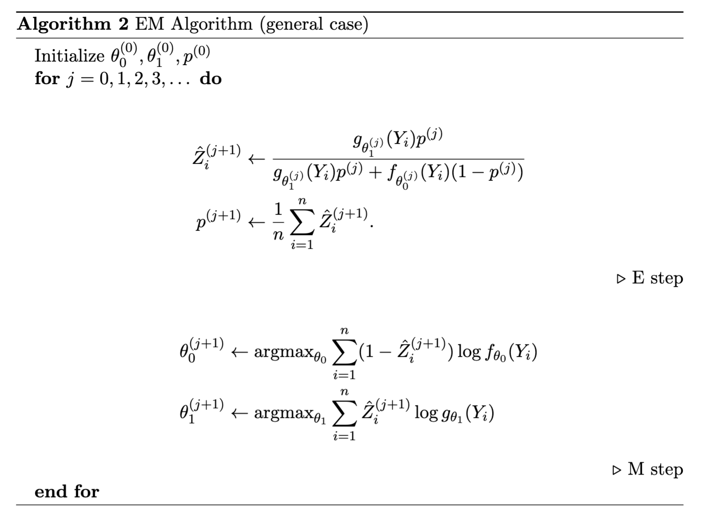

## EM Algorithm

||definition Mixture Models
When data in a distribution is drawn from one of multiple distributions, and you don't know which distribution each datapoint is.
||

A common type of mixture model is two Gaussian mixed with a Bernoulli

- $p$ to draw from $f_1 \sim \mathcal{N}(\mu_1, \sigma_1^2)$
- $1 - p$ to draw from $f_2 \sim \mathcal{N}(\mu_2, \sigma_2^2)$

This model has 5 parameters $(\mu_1, \mu_2, \sigma_1^2, \sigma_2^2, p)$

- For now, we will assume that we know $\sigma_1 = 1, \sigma_2 = 1, p = 1/2$
- Then, the log likelihood is:
  $$\ell_n(\mu_0, \mu_1) = \sum_{i=1}^n \log\paren{\frac{1}{2} \frac{1}{\sqrt{2\pi}} e^{-\frac{(Y_i - \mu_0)^2}{2}} + \frac{1}{2} \frac{1}{\sqrt{2\pi}} e^{-\frac{(Y_i - \mu_1)^2}{2}}}$$
- This is hard to optimize
- Suppose we know the labels $Z_i \in \{0, 1\}$ for each $Y_i$
  - Then optimizing is just:
    $$
    \begin{align*}
    &\sum_{i=1}^n \log \paren{f_0(Y_i)^{1-Z_i}f_1(Y_i)^{Z_i}} \\ &= \sum_{i=1}^n (1-Z_i) \log f_0(Y_i) + Z_i \log f_1(Y_i) \\
    &= -\frac{1}{2} \sum_{i:Z_i = 0} (Y_i - \mu_0)^2 - \frac{1}{2} \sum_{i:Z_i = 1} (Y_i - \mu_1)^2 + \text{const}
    \end{align*}
    $$
  - This is more easily optimizable, and can be solved with:
    $$
    \begin{align*}
    \mu_0 &= \frac{\sum_{i:Z_i = 0} Y_i}{\#\{i : Z_i = 0\}} \\
    \mu_1 &= \frac{\sum_{i:Z_i = 1} Y_i}{\#\{i : Z_i = 1\}} \\
    \end{align*}
    $$
- In reality, we don't have these labels to separate the data
  - To estimate these $Z_i$, we need to see how close we are to $\mu_0, \mu_1$
  - So we use an estimate of $\mu_0, \mu_1$ to estimate $Z_i$, and then use this to improve $\mu_0, \mu_1$
- **E Step: Estimating $Z_i$ with $\mu_0, \mu_1$**
  $$\hat{Z_i} = \exp{Z_i \mid Y_i} = \frac{e^{-(Y_i - \mu_1)^2 / 2}}{e^{-(Y_i - \mu_1)^2} + e^{-(Y_i - \mu_0)^2}}$$
- **M Step: Estimating $\mu_0, \mu_1$ with $Z_i$**
  - We use the previously derived equations:
    $$
    \begin{align*}
    \mu_0 &= \frac{\sum_{i:Z_i = 0} Y_i}{\#\{i : Z_i = 0\}} \\
    \mu_1 &= \frac{\sum_{i:Z_i = 1} Y_i}{\#\{i : Z_i = 1\}} \\
    \end{align*}
    $$

---

Let's consider a more general case, where the mixture is given by:
$$f(y) = (1-p)f_{\theta_0}(y) + pg_{\theta_1}(y)$$

- $\theta_0$ and $\theta_1$ can be multidimensional and we don't know $p$

We can apply the same ideas to get:

