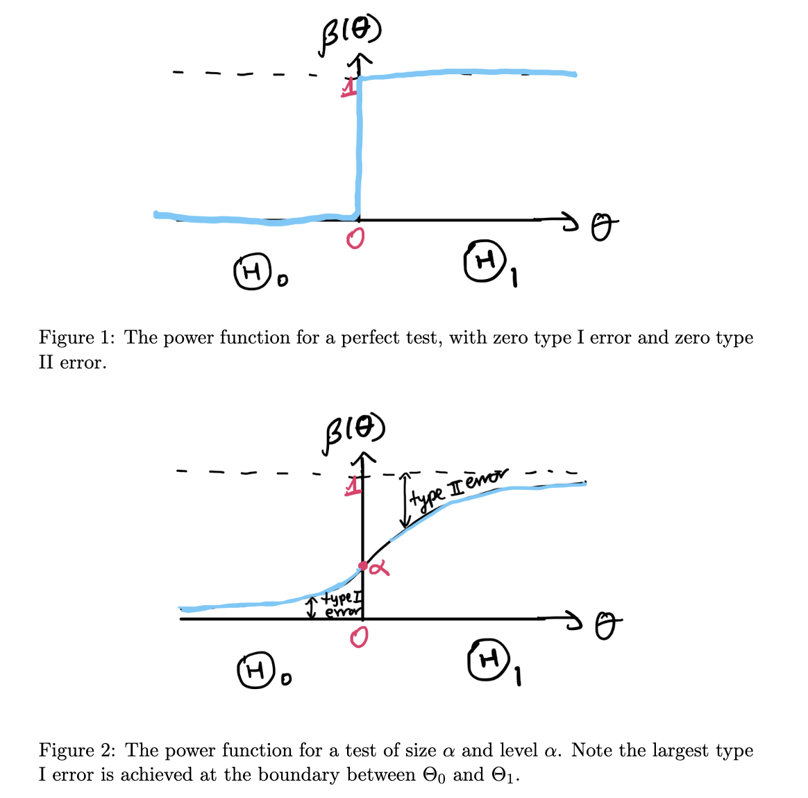

## Hypothesis Testing

- Answers binary questions such as "is a drug better than placebo"

||definition Test and Rejection Region
A **test** is a function $\Psi$ from the data to $\{0, 1\}$. The **rejection region** of a test is $R = \{\text{datasets for which } \Psi = 1\}$
||

- The rejection region fully characterizes $\Psi$

||definition Test Statistic
Function that summarizes data and is sufficient to compute a test $\Psi$
||

||definition Hypothesis Test
A **hypothesis test** takes the form
$H_0 : \theta \in \Theta_0$ vs $H_1 : \theta \in \Theta_1$
where $\Theta_0$ and $\Theta_1$ are two disjoint subsets of $\Theta$ such that their union is $\Theta$
||

- We typically characterize $H_0$ as the null hypothesis, or the status quo
- $H_1$ is a revelation or something that you prove

### Error Types

||definition Type I Error
A Type I error is when $H_0$ is true, but the test concludes $H_1$ is true. This is considered more serious in things like a criminal trial.
||

||definition Type II Error
A Type II error is when $H_1$ is true, but the test concludes $H_0$ is true.
||

The probability of a test committing an error depends on the true value of the parameter

||definition Size and Level
The **size** of a test $\Psi$ is:
$$\text{size}(\Psi) = \max_{\theta \in \Theta_0} P_\theta(\Psi = 1)$$

- I.e. it is the maximum possible probability of a type I error

A test is said to have **level** $\alpha$ if $\text{size}(\Psi) \leq \alpha$
||

- The maximum type I error probability is always achieved for $\theta$ on the boundary between $\Theta_0$ and $\Theta_1$

||definition Power
The **power** function is defined as:
$$\Beta(\theta) = P_\theta(\Psi = 1)$$

For a perfect test, the power function $\Beta$ is a step function that is zero when $\theta \in \Theta_0$ and one when $\theta \in \Theta_1$
||

