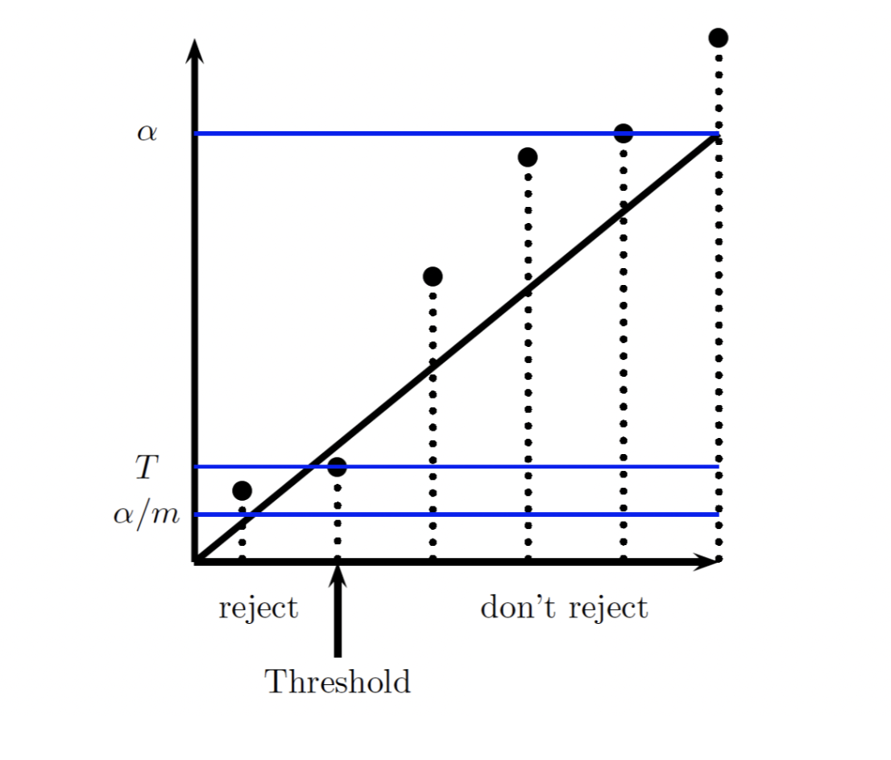

## Multiple Hypothesis Testing

- A scientist conducted a series of tests on brain voxels of a dead salmon
  - They did 8000 tests with $\alpha = 0.001$
  - They rejected 8 null hypothesis, i.e. found that 8 voxels were active in a dead fish
- The reason was because with $\alpha = 0.0001$ and 8000 tests, you are expected to find $8$ rejections
- In general, when you conduct multiple hypothesis tests, it is inevitable you will reject some of them

### Bonferroni Correction

- Instead of making each test's type I error less than $\alpha$, we set it up so:
  - The overall type I error is less than $\alpha$
  - This can be done by rejecting if less than $\alpha / m$, where $m$ is the number of tests
  - Can use the union bound to show that this makes the overall type I error probability less than $\alpha$
- This is incredibly conservative

### Benjamini-Hochberg Method

- Bonferonni correction attempts to make the expected total number of false positives less than $\alpha$, which was very conservative
- Instead, another goal might be to attempt to make the proportion of false positives out of all positives is less than $\alpha$
- We can accomplish this by:
  - Ordering all $p$ values $p_1, p_2, \dots, p_m$
  - Let $i_{\max}$ be the largest $i$ such that $p_i \leq \alpha / m * i$
  - Reject all $p_i$ such that $i \leq i_{\max}$
- This works if the test statistics are all independent from each other
- This guarantees the rejection region to be somewhere between Bonferonni and typical hypothesis testing

- Note that the leftmost datapoint is not below the line, but we reject it anyway because we are just looking for the rightmost point that is below the line, and then rejecting everything to the left of it
