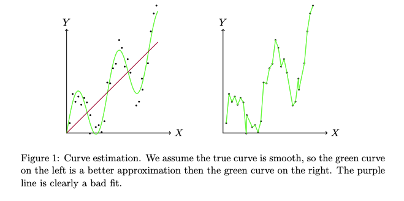
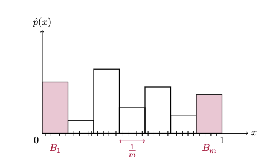
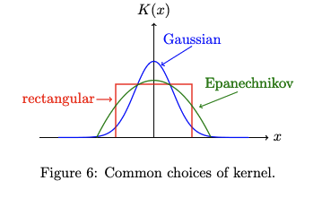

## Nonparametric Curve Estimation

This typically refers to estimating a density or regression function

- We want to fit a curve to data
- We want to fit a "smooth" curve to the data because we assume the true underlying curve is smooth
- This deals with the bias-variance tradeoff
  - A smoother curve leads to higher bias, but lower variance around each point

We consider a true function $g$ and its estimator $\hat{g}$

- Denoted as $g(\cdot) \rightsquigarrow \hat{g}(\cdot)$
- Bias: $b(x) = \exp{\hat{g}(x)} - g(x)$
- Variance: $v(x) = \var{\hat{g}(x)}$
- MSE: $\text{MSE}(\hat{g}(x)) = b^2(x) + v(x)$

||definition MISE
The mean integrated square error (MISE) is defined as:
$$R(\hat{g}, g) = \int \text{MSE}(\hat{g}(x)) dx = \int b(x)^2 dx + \int v(x) dx$$
||

### Density Estimation with Histograms

Suppose we observe samples $X_i \sim p$, where $p$ is a probability density on the unit interval

- We want to construct a histogram estimator $\hat{p}$ of $p$
  - We create $m$ equally spaced bins $B_j$ of width $h = 1/m$ and count the proportion of observations in each bin
  - $\hat{p}(x) = \sum_{j=1}^m \frac{\#\{i : X_i \in B_j\}}{nh} 1(x \in B_j)$
  - The $1/h$ is to normalize to make sure $\hat{p}$ integrates to 1 and can be ignored if just using for visualization

Bias of $\hat{p}$:

- If $p$ is smooth, we can do the calculation to find that the bias at any point $x$ is $0$ as $h$ goes to $0$
- The same can be said for the integrated square bias
- As $h$ decreases, the bias decreases

Variance of $\hat{p}$:

- We can do the calculation to find that when $h$ is small, we have that:
- $v(x) \approx \frac{1}{nh} p(x)$
- Therefore, the smaller the bin width, the larger the variance

This gives the idea that there is some intermediate point with an optimal $h$

- However, finding this depends on the true, unknown density $p$
- Cross validation with a testing set can help to find this value of $p$

## Kernel Density Estimators

Previously, we were estimating a function by a discontinuous step function

- We want to estimate via another smooth function

||definition Kernel
A kernel $K$ is a function satisfying $K(x) \geq 0$, $\int K(x) dx = 1$, and $\int x K(x) dx = 0$
||

- This is true of any pdf symmetric about the origin (i.e. the Gaussian pdf)

||definition Kernel Density Estimator
A kernel density estimator (KDE) of $p$ with kernel $K$ is the estimator:
$$\hat{p}(x) = \frac{1}{nh} \sum_{i=1}^n K\paren{\frac{x - X_i}{h}}$$
||

- For the rectangular kernel, $\hat{p}$ will not be smooth, but we will get a smooth function if $K(x)$ itself is smooth
- In the contxt of KDEs, $h$ is called the bandwidth

||definition 2D Kernel Density Estimator
$$\hat{p}(x) = \frac{1}{nh^2} \sum_{i=1}^n K\paren{\frac{x - X_i}{h}} K\paren{\frac{y - Y_i}{h}}$$
||
