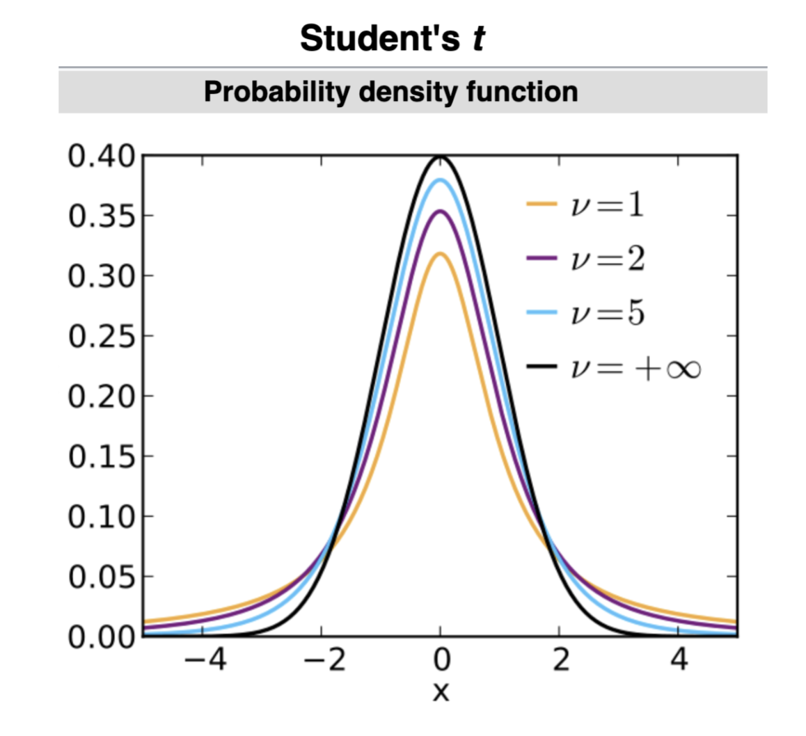

## T Test

- Previously in the Wald test, we assumed that $n$ was large so sample means would approach the true mean with the CLT
- However, for small $n$ this doesn't work
- When we know the data is normally distributed, we can instead use the $t$ distribution with $n - 1$ degrees of freedom

||definition Student's t-distribution
This distribution with $\eta$ degrees of freedom is given with pdf:
$$f(x) = \frac{\Gamma(\frac{\eta + 1}{2})}{\sqrt{\eta \pi} \Gamma(\frac{\eta}{2})}\paren{1 + \frac{x^2}{\eta}}^{-\frac{\eta + 1}{2}}$$
||

- $\sqrt{n} \cdot \frac{\overline{X}_n - \mu}{\sigma}$ is exactly distributed according to $t_{n-1}$
- This requires that we assume normality, but this can be checked with the KL test first

