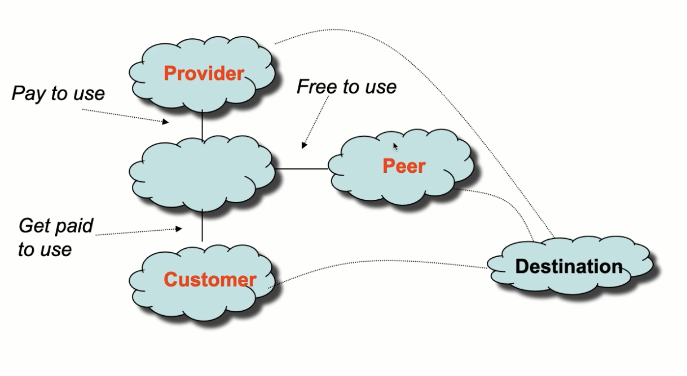
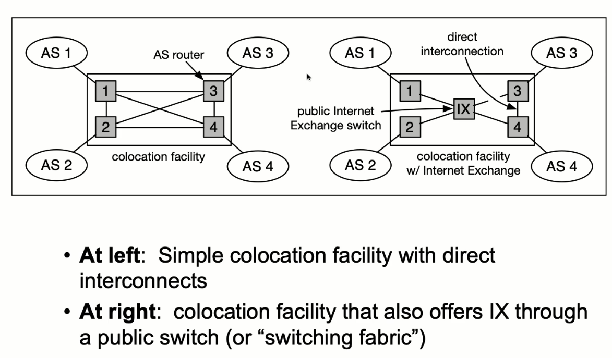
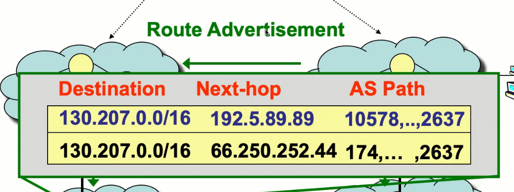
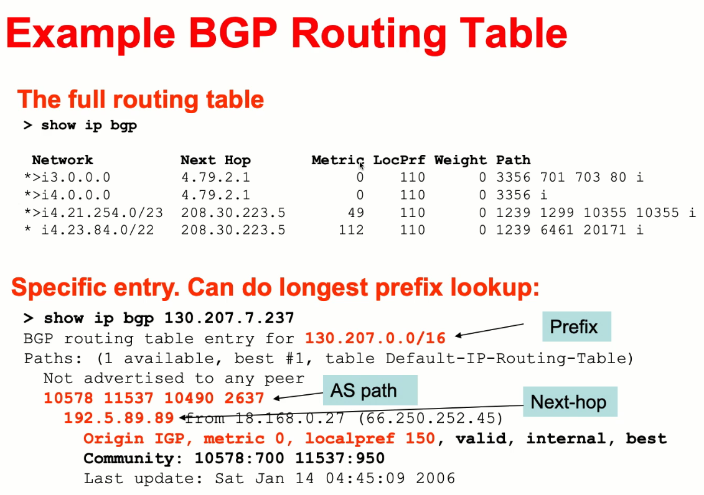

## Routers and ASes

- A router is a device with multiple ports that connects to multiple devices to form a network
- Each router has a chip inside that determines how to route
- The overall network is very complicated with many different sizes

||definition Autonomous System
A set of routers that all belong to some owner (i.e. AT&T or MIT)
||

- These ids used to just fit in 16 bits but at some point they didn't so now we use 32 bits

||definition Competitive Cooperation

- Entities must cooperate for global connectivity
- But each one wants to make money
  ||

- Routers advertise to each other:
  - They tell each other about which other servers it can reach so the other servers know to send packets to them
- Currently, there is no central authority, it's all through these bilateral connections
  - In the beginning of the internet (ARPANET), there was a large national backbone network with smaller regional networks connecting to them to form a hierarichal structure

- This was gradually replaced with multiple backbone providers
- As there became more interconnection, we get to modern day
  - A lot flatter, more interconnected
  - Rise of CDN's (content distribution networks) that do a lot of caching on the Internet

||definition Routing Prefix
A range of IP addresses based on addresses with the same bistring prefix

- Routers have forwarding table entries that correspond to an address of prefix
- I.e. `18.0.0.0/8` stands for all IP addresses where the first 8 bits are just 18

  - `18.31.0.0/17` stands for all IP addresses where the first 17 correspond to `18.31`
    ||

- Forwarding rules commonly use the longest matching prefix

||definition Subnetworks
Ranges coresponding to routing prefixes that are a power of two size
||

## Internet Business Model

- Money flows from customers to providers
  - When customers pay providers, they get to view the providers' routing tables in exchange for money
  - Since providers want to increase their customers usage (so the customers pay more money), they will provide their entire routing table to the customer
- Why have peering?
  - You want to collaborate and give each other's routes to get more visibility without having to pay money
    - These are typically with contracts that say things like can't be to imbalanced
  - At the very top, we need peering relationships

||definition Transit
Technical word for the customer / provider relationship (a service provided for a fee)

- Can be "partial" or "full" depending on whether the customer receives every route
  ||

- When a router receives advertisements, it filters what it advertises
  - When it receives advertisement from a customer:
    - It will always advertise to everyone
    - It will increase likelihood of using the customer
  - When it receives routes from provider:
    - It will only advertise to customers
    - Announcing to peers will cause them to lose money
  - When it receives routes from peers:
    - Same as above
- The incentive to peer is to avoid paying providers to get to the route (this also makes the number of hops lower)
  - There is only incentive if it is somewhat symmetric (i.e. MIT and YouTube will not peer)

## BGP

- BGP provides capabilities for enforcing various policies, but they are not a part of BGP
- BGP allows you to choose from multiple paths
- Import policy:
  - How to select best paths
- Export policy:
  - What routes to announce (what we just covered)
- Paths in BGP that are advertised are just at the AS level
  - To actually route within an AS, have to use other methods

### Interconnection

- Interconnecting two networks requires both physical and network connectivity
- Could be done through either:
  - Direct, dedicated physical connection
  - Public connection where all networks connect to a public Internet Exchange switch

### BGP Continued

- BGP sessions are created between border routers in ASes that are directly connected
- These are used to send advertisements to each other
- The routing table looks like:
  - Next-hop = immediate next IP to send to
    - When you set up a router, each port is assigned an IP address
  - AS path = the list of ASes this will have to traverse
    - This is used to inform which path you should choose to take

- To determine paths, uses path-vector routing
  - Extension of distance-vector routing
  - Key idea: advertise the entire path instead of just the distance to get to a destination
- Gives a lot more flexibility in allowing routers to choose what to use / advertise based on what the path looks like

### Different Types

- eBGP - external BGP for exchanging routes between ASes
- iBGP - internal BGP for distributing routes to external destinations among routers within an AS

---

- Interior Gateway Protocol: distributes routes to interior destinations among routers within an AS
  - Examples include RIP or OSPF
  - iBGP provides a way by which routers to exchange information about external routes and includes things to help prioritize certain routes over others
  - Could use IGP instead of iBGP but would not have the rich set of attributes and they likely don't scale as well

### iBGP

- Gets more challenging once you have multiple border routerse (eBGP routers)
- Can be run with either:
  - Full mesh: each eBGP router has an iBGP session with every other router in the AS
  - Route reflection: each eBGP router has an iBGP session with a route reflector, and then each router has an iBGP session with the reflector

### Choosing Routes

- BGP routes all have the following attributes on which route selection is based:
  - Local preference (LOCALPREF): numerical value assigned by routing policy
  - AS path length: number of AS-level hops
  - Multiple exit discriminator (MED): allows one AS to specify one exit point is more preferred than another
  - eBGP over iBGP
  - Shortest IGP path cost to next hop - shortest way to get out of the current AS (hot-potato routing)
    - Idea is you want to minimize the amount of time you're carrying this packet, because that is incurring costs for you
  - Router ID tiebreak - arbitrary

## BGP Pitfalls / Problems

- No authentication / validation for route advertisements
  - If you can hack into a router and add an entry that incorrectly forwards, you can redirect traffic
  - Used to steal 17M in Ethereum
