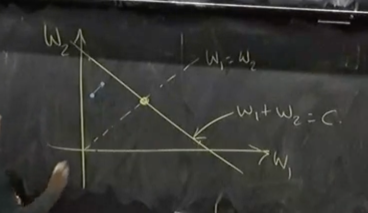
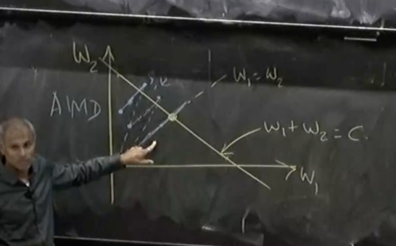
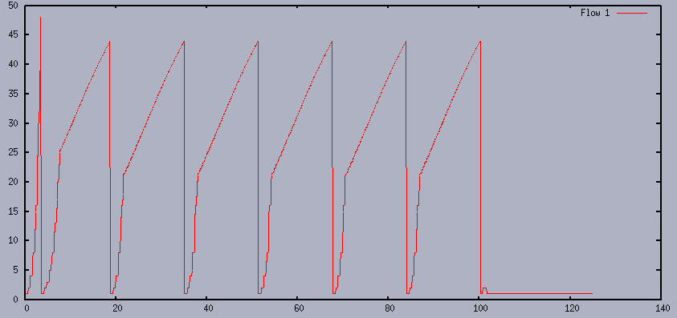
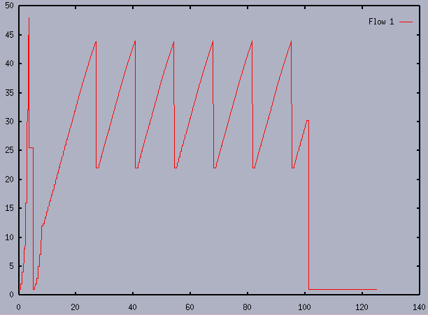
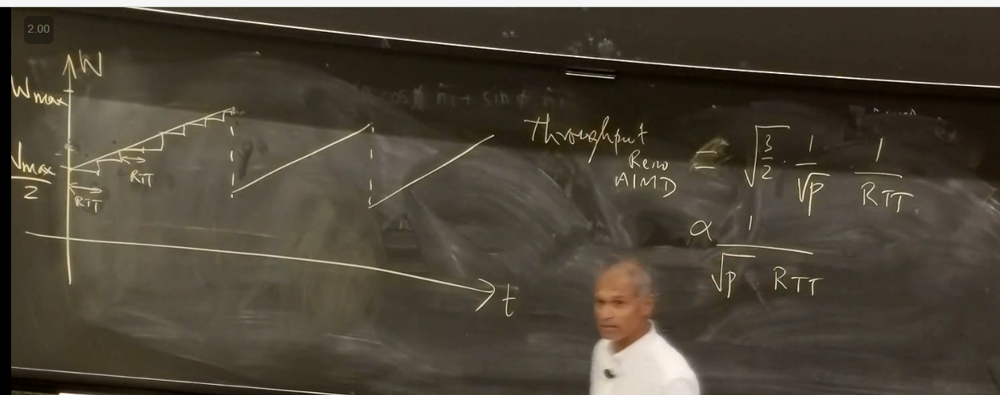
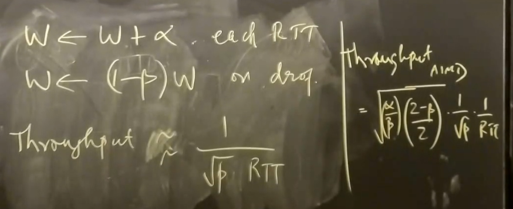

## Congestion Control

### Congestion Control Problem

- What is the congestion control problem?
  - Matching the rate of sending to the capacity of the network
- Simplest version of problem:
  - $n$ senders, $n$ destinations with one bottleneck link in between all of them
    
  - Servers labeled $S_1, \dots, S_n$ and $D_1, \dots, D_n$
  - Capacity of bottleneck links is $C$
  - Going to assume all packets have the same size
    - It will matter later
    - For now, we will just use this, so we can label $C$ as packets / second
- We're not going to worry too much about fairness today, but it will turn out to be important
  - There are multiple notions of fairness
  - We will worry about just not making it overly unfair
- We often care about efficiency / utilization
  - What fraction of the bottleneck link are we using
- We want scalability to bigger networks
- There are other concerns like packet delay / latency but we won't worry about them

---

- Congestion collapse:
  - As the network slows down, people start retransmitting packets that are stuck in long queues and this causes even more overload
  - Makes efficiency harder to achieve
- Big key goal of congestion control is to avoid congestion collapse

---

- If we plot offered load (i.e. how much load all of the senders want to send) vs actual throughput (i.e. how many packets of useful work is being received), what do we expect the curve to look like?
  - Should scale with offered load until it reaches the maximum $C$
    
- Problem: we need to handle bursts of traffic
  - We add queues to help this transient congestion, but it doesn't solve persistent congestion
  - This allows us to operate slightly past the "knee" but at some point we will start to drop packets and it will lead to congestion collapse
  - This leads to the dip
    
  - We need to avoid our queues becoming too long to avoid congestion collapse
- To avoid congestion collapse, early implementations of TCP tried to estimate the RTT and deviations from the RTT to calculate timeouts for when a packet is marked as dropped
  - These would adapt to delays present in the network
  - Use this to inform when you re-send it (leads to congestion control algorithm)
- To really get a better sense of the amount of congestion in the problem, we will need to improve our algorithm

## Congestion Control Algorithm

- We're going to assume all packet drops are due to congestion
  - Then, number of packet drops (measured through lack of ACKs) is our measure of congestion
- All of the action for congestion control is happening end to end
  - The routers are just sitting with queues and dropping packets
- Key Idea: When you drop a packet, re-transmit it but slower
- This idea requires everyone to be cooperating
  - We will hear more about rotten mechanisms later

### Windows

- We have a window that determines which packets we can send
- If window size is 4, we can send packets 1, 2, 3, 4
  - We can only send 5 once we get an ack for 1
- **Linear Controls**:
  - When no congestion, for each RTT, window size goes from $W$ to $(1+b_I)W + a_I$
  - When there is congestion, window size goes to $(1 - b_C) - a_C$
  - Typically, you just have for each part either just a multiplicative increase or an additive increase (or decrease)
- The only scheme that achieves convergence to highest utilization and convergence to equitable is:
  - Additive increase, multiplicative decrease
- To see why this situation is good, let's consider $n = 2$:
  - Efficient: $W_1 + W_2 = C * RTT$
  - Fairness: $W_1 = W_2$
  - We'd like something in the ideal world to converge to the point where these intersect
- Any time we're below the efficiency line, we're uncongested so both algorithms will increase
  - This will lead to moving closer to the efficiency line
    
  - When we cross the efficiency, we're going to be congested and move towards the origin
    - Both are going to decay by some multiplicative factor
      
  - One note, even if we are not on the $W_1 + W_2 = C * RTT$ line, it just means we aren't congesting, so we could still be getting good utilization if there is at least one thing in the queue at all times
- TCP algorithms, to increase convergence speed, use a slow start phase that uses multiplicative increase and multiplicative decrease to hit congestion

## TCP Tahoe

- The first version of TCP with built in congestion control algorithms
- From the late 80s
- Slow start phase:
  - `SSThresHold`: the window size that TCP believes is safe to use
    - This is initialized to `AWS`
    - This is halved when we detect a packet loss
  - `CWND`: the current congestion window size
    - Doubles every RTT when there is no packet drop
    - It does this by every time we receive an ACK, we increase window size by 1
      - What this means is that when I send $1, 2, 3, 4$, and I receive ack for $1$, I can send both $5$ and $6$ now
      - Receiving a new ACK is defined as receiving a higher ACK number than the latest received one
        - Remember that an ACK is sent back with the number of the highest number such that everything up to that number has been received
  - Ends when `CWND` surpasses `SSThresh` OR if there is a packet loss
    - If packet loss, then, `SSThresh` is halved and we restart
    - So we only leave cold start when `CWND > SSThresh`
      - Signifies that we are in "uncharted" territory and we need to increase the congestion window slower
  - During this entire process, TCP is measuring RTT to get an update
- Congestion avoidance phase:
  - `CWND` increases by 1 every RTT when there is no packet drop
    - Effectively done by increasing by $1 / \text{CWND}$ after each ACK
  - When a packet is dropped, set `SSThresh` to `CWND / 2` and then go to the slow start phase
- Fast retransmit:

  - When a packet is dropped, the packets that follow the dropped one will trigger duplicate ACK messages
  - However out of order packets will also result in duplicate ACKs
  - To avoid misinterpreting duplicate ACK as packet loss, the TCP will conclude packet loss after receiving 3 duplicate ACKs (4 identical ACK packets)
  - This will cause the lost packet to be transmitted immediately and enter the slow start phase

## TCP Reno

- Adds Fast Recovery to TCP Tahoe
- We try to distinguish between heavy congestion and moderate congestion

  - If there is heavy congestion, we must reduce the network traffic drastically so everything should slow start
  - If there is moderate congestion, a slow start is too drastic
    - Better would be to reduce `CWDN` by half and remain in congestion avoidance movie

- To detect moderate congestion, can realize that many packets will still get through, so there will be many duplicate ACK messages

  - We end up using that same number (3) to determine whether or not we are in moderate congestion
  - So we piggyback on the code to trigger fast retransit

- So when we receive 3 duplicate ACKs, we instead:

  - Set `SSThresh` to `CWND / 2`
  - Set `CWND = SSThresh + 3`
    - Idea is that this was triggered by 3 packets after the dropped, so the network could handle these bytes
  - We will stay in congestion avoidance

## Optimal Buffer Size

- In steady state with TCP Reno, we constantly sawtooth between $W_\min$ and $2W_\min$
  - We are on average at $1.5W_\min$, which means that if $2W_\min$ is our network capacity (with no queue) then we are only at 75% usage of our link
- We want 100% usage, so $W_\min \geq C * RTT$, which is the **bandwidth delay product**
  - This is the maximum bandwidth that can be sent on the link
- To actually let us get up to $2 * W_\min$ when we have $W_\min$ be the maximum, our buffer should be of size $W_\min$

## Bandwidth Delay Product

- In typical literature, the $C$ is actually equal to the bandwidth delay product
- It is equal to (what people typically call $\mu$) multiplied by the minimum RTT (that is, the minimum possible time it takes to send without any queues or any congestion)
- Essentially equal to how many packets this network can support without any queues building up
- It turns out that all of these congestion control algorithms are trying to estimate what this BDP is and get their window sizes to match it
- Problem with trying to estimate this:
  - To measure minimum RTT we need to send a single packet
  - To measure the bottleneck number of packets per second, we need to send a lot of packets

## TCP Reno Alternatives

- TCP Reno pushes and tries to get a situation where the queues are always full
- This means that if the queue sizes are set poorly, then this is going to lead to long queues and bad delays
- BBR tries to estimate the $\mu$ and $\text{RTT}_\text{min}$
- Cubic tries to do something different based on an analysis of TCP Reno to make sure it doesn't do worse than the TCP Reno

### Analysis

- $N$: the number of packets we send in a period $\tau$ (which we say is one triangle in the figure)
  - $N = \int_0^\tau \frac{w(t)}{RTT} dt$
- $p$: drop rate
  - $p = 1 / N$ because every time
- Throughoutput is then $N / \tau = 1 / (p \cdot \tau)$

---

Specifically for Reno:

- We can do some math and only consider quadratic terms to get that $N = \frac{3}{8}W_\text{max}^2$
  - $N = W / 2 + (W / 2 + 1) + \dots + (W / 2)$
    - $W$ is $W_\text{max}$ for brevity's sake
- $\tau = W_\text{max} / (2 * \text{RTT})$
- Combining all of this gives:
  - Throughput = $\sqrt{\frac{3}{2p}} \cdot \frac{1}{\text{RTT}}$
- One thing: this property of inversely proportional to $\sqrt{p}$ and RTT is because of AIMD in general, not just Reno's numbers

## Cubic

### Background

- Proposed to try to handle higher and higher bandwidths
  - RTT wasn't going down, but this was
  - As the Internet scaled, the linear increase was going to become terrible when connections are dropped / added
- The authors tried thinking about using the state of the last $W_\text{max}$ you were just reduced from upon packet loss
  - The idea was to fix TCP Reno which completely forgot about this
  - Binary searching was proposed but ended up leading to a ton of bursting on the network which was bad since as you binary searched you would jump by huge amounts
- The idea behind cubic is to start increasing fast and then as you approach the place where you previously were cut from, you should start increasing slowly again
  - Then if you pass it, you want to start increasing quickly again
  - If you stare at it, this looks like a cubic function
    
- They then fit a mathematical function to this and also do some math with the above analysis to ensure that at peak they are never slower than Reno
  - This means they fine-tuned their constants for $\alpha$ and $\beta$ so that when you are near $W_\text{max}$, you are doing better than Reno
- Another thing they wanted was to make this somewhat independent of RTT
  - In Reno, if you have less of an RTT, you will be able to push your window size faster, which will give you more bandwidth
  - To get around this, you could increase your window size by some constant \* RTT each RTT, but this ends up not working because RTT is very noisy and the algorithm becomes super unstable

### Algorithm

- We still use multiplicative decrease of $(1 - \beta)$ upon reaching a packet loss
- Set window size when no packet loss as:
  - $W(t) = c(t-k)^3 + W_\text{max}$
  - $k$ is the amount of time it takes you to get to $W_\text{max}$ in seconds
    - We can derive $k$ as $k = \frac{\beta W_\text{max}}{c}^{1/3}$
- Since this is real time based, it should theoretically be independent of RTT
- To actually implement this, everytime we receive an ACK, we use all of the information available to us to determine by how much should we increment to roughly stay on this curve
  - We look at our target - our current
  - Divide that by current window size and add that
- To ensure this is never less than Reno, they also compute an $\alpha$ based on their $\beta$ to match Reno
  - This $\alpha$ is computed so that using the analysis in the image at the end of the background section, the throughput using this $\alpha$ would have matched the Reno algorithm
  - Uses whichever one offers a bigger step size: this $\alpha$ or what was computed via $W(t)$

### Analysis

- Doing the same analysis for throughput with an integral gives you:
  - Proportional to $\frac{1}{RTT^{1/4} p^{3/4}}$
- This didn't actually eliminate the RTT as a factor, but it did lessen it
- We also lessened the impact of drop rate (since $p < 1$, square root is worse than $3/4$ power)

## BBR

- Trying to separately estimate bottleneck bandwidth $\mu$ and min RTT (what they call RTProp)
  - Idea is RTProp includes speed of light delay and processing / transmission time incurred
- They set what is called a pacing rate to be:
  - Estimated BDP / RTT \* pacing gain
    - This is different from RTT min because it could be higher as we have added congestion
  - On average, pacing gain will be 1
- Also enforces the number of inflight packets is at most 2 _ pacing rate _ RTT
  - Prevents the buffer from being destroyed if you have a good estimate of the BDP
- To estiamte bottleneck bandwidth:
  - For each RTT look at how long it took and how many packets were acknowledged
  - Use this to compute a bandwidth for this
  - Use the last 6-10 estimate and take their maximum
  - To do some experimentation / pushing and prodding, every few RTTs you increase your pacing gain to 1.25 and then decrease it to 0.75 for the next one
- To estimate min RTT
  - Keep track over your entire time of what the min RTT you observed was
  - Every once in a while, do an RTT probe where you just send 3-4 packets in the entire RTT just to try to empty out the queue and see what happens
- This does not react to packet drops at all!
  - This was for BBR version 1, but this ended up being bad
  - Version 2 reacts to them
