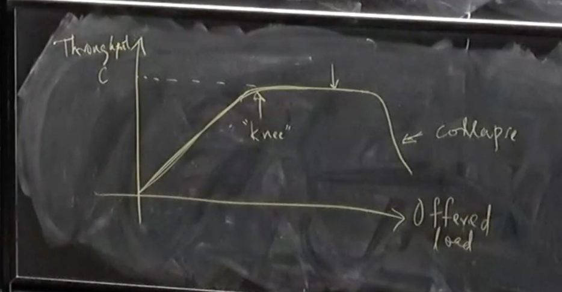

## Congestion Control

### Congestion Control Problem

- What is the congestion control problem?
  - Matching the rate of sending to the capacity of the network
- Simplest version of problem:
  - $n$ senders, $n$ destinations with one bottleneck link in between all of them
    
  - Servers labeled $S_1, \dots, S_n$ and $D_1, \dots, D_n$
  - Capacity of bottleneck links is $C$
  - Going to assume all packets have the same size
    - It will matter later
    - For now, we will just use this, so we can label $C$ as packets / second
- We're not going to worry too much about fairness today, but it will turn out to be important
  - There are multiple notions of fairness
- We often care about efficiency / utilization
  - What fraction of the bottleneck link are we using
- We want scalability to bigger networks
- There are other concerns like packet delay / latency but we won't worry about them

---

- Congestion collapse:
  - As the network slows down, people start retransmitting packets that are stuck in long queues and this causes even more overload
  - Makes efficiency harder to achieve
- Big key goal of congestion control is to avoid congestion collapse

---

- If we plot offered load (i.e. how much load all of the senders want to send) vs actual throughput (i.e. how many packets of useful work is being received), what do we expect the curve to look like?
  - Should scale with offered load until it reaches the maximum $C$
    
- Problem: we need to handle bursts of traffic
  - We add queues to help this transient congestion, but it doesn't solve persistent congestion
  - This allows us to operate slightly past the "knee" but at some point we will start to drop packets and it will lead to congestion collapse
  - This leads to the dip
    
  - We need to avoid our queues becoming too long to avoid congestion collapse
- To avoid congestion collapse, early implementations of TCP tried to estimate the RTT and deviations from the RTT to calculate retransmission times
  - These would adapt to delays present in the network
- To really get a better sense of the amount of congestion in the problem, we will need to improve our algorithm

## Congestion Control Algorithm

- We're going to assume all packet drops are due to congestion
  - Then, number of packet drops (measured through lack of ACKs) is our measure of congestion
