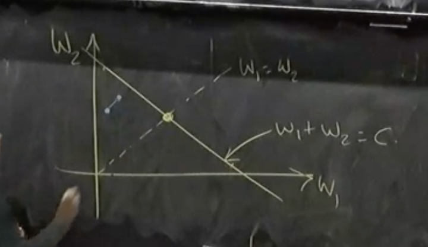

## Congestion Control

### Congestion Control Problem

- What is the congestion control problem?
  - Matching the rate of sending to the capacity of the network
- Simplest version of problem:
  - $n$ senders, $n$ destinations with one bottleneck link in between all of them
    
  - Servers labeled $S_1, \dots, S_n$ and $D_1, \dots, D_n$
  - Capacity of bottleneck links is $C$
  - Going to assume all packets have the same size
    - It will matter later
    - For now, we will just use this, so we can label $C$ as packets / second
- We're not going to worry too much about fairness today, but it will turn out to be important
  - There are multiple notions of fairness
  - We will worry about just not making it overly unfair
- We often care about efficiency / utilization
  - What fraction of the bottleneck link are we using
- We want scalability to bigger networks
- There are other concerns like packet delay / latency but we won't worry about them

---

- Congestion collapse:
  - As the network slows down, people start retransmitting packets that are stuck in long queues and this causes even more overload
  - Makes efficiency harder to achieve
- Big key goal of congestion control is to avoid congestion collapse

---

- If we plot offered load (i.e. how much load all of the senders want to send) vs actual throughput (i.e. how many packets of useful work is being received), what do we expect the curve to look like?
  - Should scale with offered load until it reaches the maximum $C$
    
- Problem: we need to handle bursts of traffic
  - We add queues to help this transient congestion, but it doesn't solve persistent congestion
  - This allows us to operate slightly past the "knee" but at some point we will start to drop packets and it will lead to congestion collapse
  - This leads to the dip
    
  - We need to avoid our queues becoming too long to avoid congestion collapse
- To avoid congestion collapse, early implementations of TCP tried to estimate the RTT and deviations from the RTT to calculate timeouts for when a packet is marked as dropped
  - These would adapt to delays present in the network
  - Use this to inform when you re-send it (leads to congestion control algorithm)
- To really get a better sense of the amount of congestion in the problem, we will need to improve our algorithm

## Congestion Control Algorithm

- We're going to assume all packet drops are due to congestion
  - Then, number of packet drops (measured through lack of ACKs) is our measure of congestion
- All of the action for congestion control is happening end to end
  - The routers are just sitting with queues and dropping packets
- Key Idea: When you drop a packet, re-transmit it but slower
- This idea requires everyone to be cooperating
  - We will hear more about rotten mechanisms later

### Windows

- We have a window that determines which packets we can send
- If window size is 4, we can send packets 1, 2, 3, 4
  - We can only send 5 once we get an ack for 1
- **Linear Controls**:
  - When no congestion, for each RTT, window size goes from $W$ to $(1+b_I)W + a_I$
  - When there is congestion, window size goes to $(1 - b_C) - a_C$
  - Typically, you just have for each part either just a multiplicative increase or an additive increase (or decrease)
- The only scheme that achieves convergence to highest utilization and convergence to equitable is:
  - Additive increase, multiplicative decrease
- To see why this situation is good, let's consider $n = 2$:
  - Efficient: $W_1 + W_2 = C * RTT$
  - Fairness: $W_1 = W_2$
  - We'd like something in the ideal world to converge to the point where these intersect
- Any time we're below the efficiency line, we're uncongested so both algorithms will increase
  - This will lead to moving closer to the efficiency line
    
  - When we cross the efficiency, we're going to be congested and move towards the origin
    - Both are going to decay by some multiplicative factor
      
  - One note, even if we are not on the $W_1 + W_2 = C * RTT$ line, it just means we aren't congesting, so we could still be getting good utilization if there is at least one thing in the queue at all times
- TCP algorithms, to increase convergence speed, use a slow start phase that uses multiplicative increase and multiplicative decrease to hit congestion

## TCP Tahoe

- The first version of TCP with built in congestion control algorithms
- From the late 80s
- Slow start phase:
  - $C_\text{wnd} \leftarrow C_\text{wnd}$ every RTT
  - It does this by every time we receive an ACK, we increase window size by 1
  - What this means is that when I send $1, 2, 3, 4$, and I receive ack for $1$, I can send both $5$ and $6$ now
- When we hit a packet loss, slow start ends and we halve our window size
  - We then start avoidance phase where we increase by 1 every RTT and half every packet loss
  - This is implemented as increasing our window size by $1 / C_\text{wnd}$ after each ACK
- TODO: figure out what TCP Tahoe / Reno actually implement
- Figure out what he meant by the buffer size calculation
