## Datacenter Networks

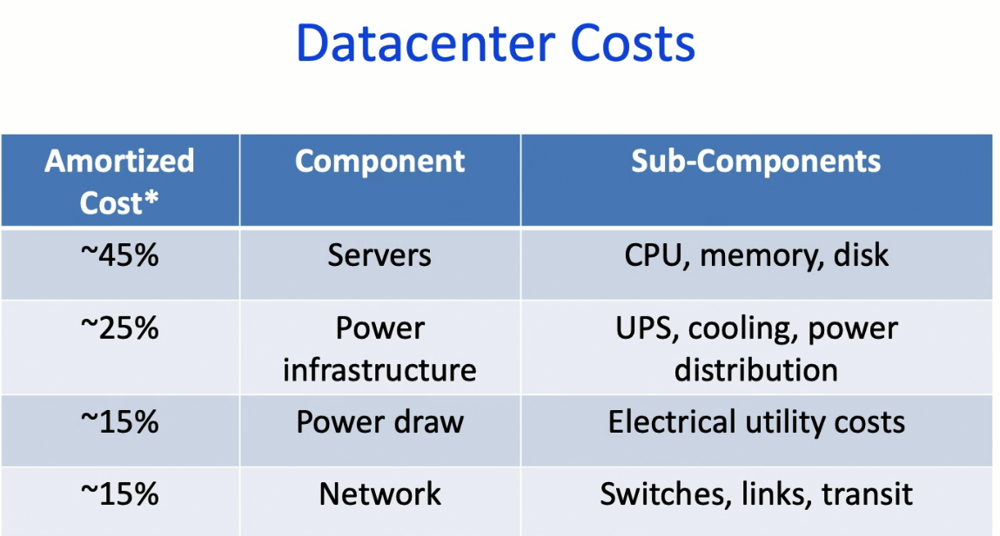

- In most datacenters, 30-50% utilization is considered "good"
- Why is it difficult to get efficient server utilization?
  - Datacenters have to keep it low utilization to keep enough compute in reserve for spikes in utilization
  - Also has for fault tolerance
  - Uneven application fit
    - Each server has CPU / memory / disk and most applications exhaust one resource and not the others

**Role of the Network**:

- Enable high server utilization by getting servers across the datacenter to be able to communicate effectively with one another
- Turn the servers into a single large fungible pool of resources
- Don't make the developer think about where their application is
  - Provide the illusion of "one big switch" no matter where the servers are in the datacenter
  - We'll have to implement it with smaller switches
- When measuring latency, we not only care about average latency but also tail latency
  - I.e. 99.9th percentile latency (three 9s)

### Tree Topology

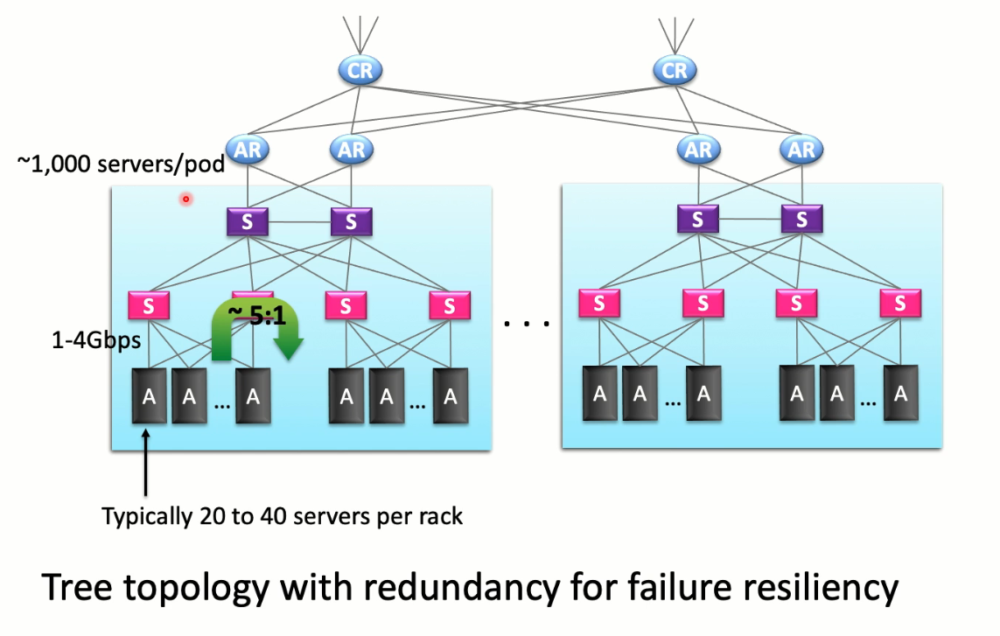

- We have redundancy to provide failure resiliency (so there are multiple ways to communicate with a server)
- We run into a problem of imbalanced uplinks vs downlinks
  - Say five servers want to communicate with another server (i.e. some controller)
  - Then, the switch above the server is getting 4 incoming and only 1 outgoing, which causes inefficiencies because of the imbalance
  - As we get higher up in the tree, we could get something like 200:1 imbalance
- If these tree networks are statically provisioned:
  - This was common back in the early days
  - Then if half of your serverse aren't doing work, then there's an efficiency issue
- How do we get a more dynamic allocation?
  - Decouple ip address from location
  - Before, we had a specific chunk of the datacenter be this IP address
  - Adding new servers would require you to update a bunch of routers' routing tables
  - Instead, we will virtualize everything
    - We will have our own layer over IP addresses to not treat them as physical locations but as just names

## Virtual Layer 2 (VL2) Switch

**Goals**:

- Uniform high capacity
  - Maximum rate of server-to-server traffic flow should only be limited by capacity on NICs
  - Assinging servers to service should be independent of network topology
- Performance isolation
  - Traffic of one service should not affect others
- Routing / addressing
  - Easily assign any server to any service
  - VM keeps the same IP address even after migration

**Key Ideas**:

- Use Clos topology to connect servers
- Valiant load balancing to provide high bisection bandwidth across multiple paths
- Name / location separation

**Graphs**:

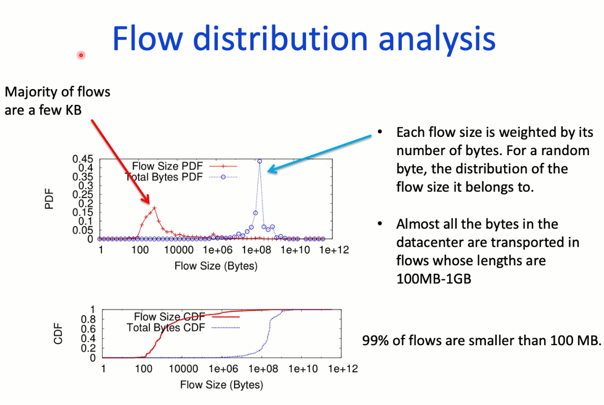

- There are a ton of small flows
- But most bytes are part of a very large flow
- We'll see later ML workflows are not like this

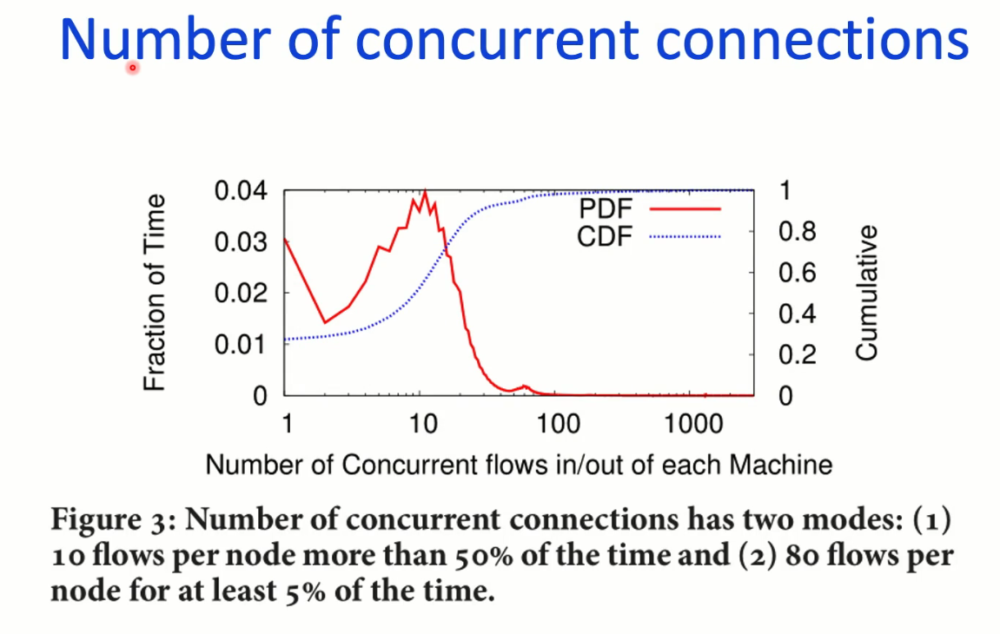

**Traffic Matrix Analysis**

- Can we predict based on the past the amount of traffic between two servers?
  - Hard to do this because we wanted to isolate the applications from the servers they are running on
  - The pattern changes nearly constantly with no periodicity and a lot of randomness

### Clos Topology

- Use a huge number of paths
- We organize switches in two layers
- A bunch of servers are all connected to some leaf switch (aggregation router)
  - The layer above the leaf switch is called the spine
  - The spine and leaf form a fully connected network
- We create so many paths between two layers that we can create non-blocking performance
- Emulates just having a big switch

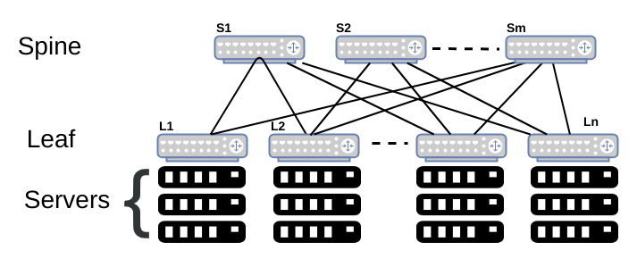

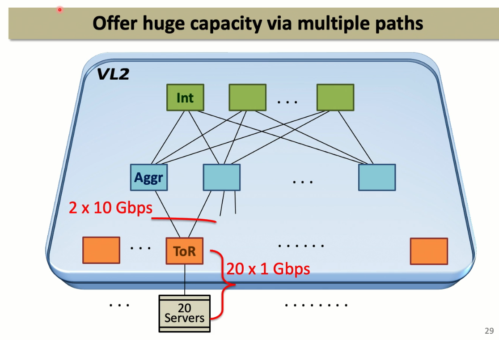

### Routing

- We have a lot of redundancy in routing
- We want to load balance
- We can't just use what is on the Internet
  - This won't load balance
  - We would have to send tons and tons of routing entries / messages, but this doesn't scale well when $N$ is going to the millions
- We want something cheap and simple that we can deploy at scale
  - We can just use randomness to distribute among all paths that ahve the same cost
- How do we decide when to keep a flow on the same route?
  - I.e. there are some flows sensitive to reordering that we might want to stay on the same path
  - If you have TCP, you should keep that flow entirely on the same path rather than split up the packets
  - With this, we can hash a 5-tuple of the packet header information and then modulo it by number of equal cost paths to get which path to send it along
- This does lead to suboptimal balancing
  - Elephant (super large) flows are a problem and also hash collisions
- Are hash collisions a problem?
  - We can set up our network so that the uplinks of our switches are a lot higher capacity than our downlinks
    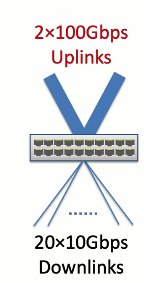
  - Intuition for why this mitigates hash collision problem:
    - Imagine we have 20 bins each with size 1 and we throw 10 balls in
    - Or we have 2 bins each with size 10 and we throw 10 balls in
    - What is probability of staying within capacity?
      - First: 3.27%
      - Second: 99.95%

## Congestion Control

Why would this be different in a data center?

- You're not taking advantage of a lot of properties within a data center
  - I.e. you own everything
  - You can look at traffic properties
- You have control over all of the hardware in the datacenter

We want to complete flows quickly:

- Two types of flows:
  - Short messages (i.e. queries or coordination)
    - These desire low latency
  - Large flows (i.e. data update)
    - These desire high throughput
- Our previous discussion of TCP didn't really think about these two types
  - It's hard to think about them on the wide Internet
- Large buffers help absorb high throughput, but this leads to high latency

### DCTCP

- Main idea: because we can ensure all of our routers are ECN (explicit congestion notification) enabled, we can use the ECN marks to figure out how much to cut the window
  - By using this, it can keep the buffer occupancy small and ensure latency on the whole is more consistent
  - When we do send a large volume flow,

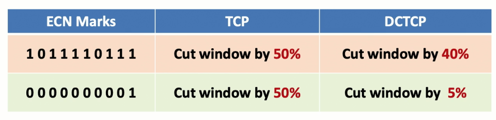

- Switch marks packet when queue length > K
- Sender maintains running average of fraction of packets marked
  - Exponential running average
  - Uses this to figure out how to change the window
  - When everything is marked, we do the same thing as TCP (cut the window in half)

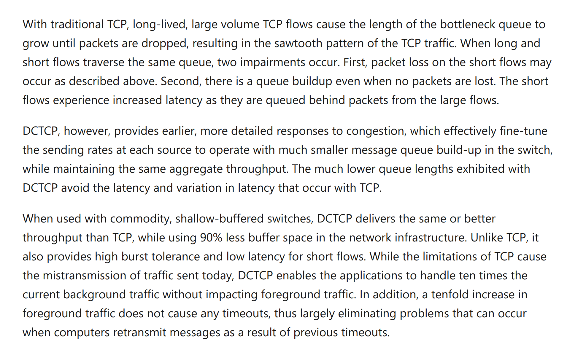

### ML Training Jobs

- When training across multiple GPUs, we need to look at communication across them

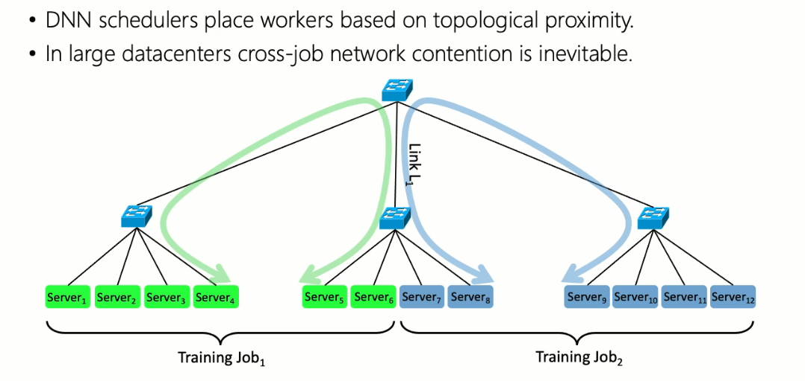

- Communication pattern of DNN training:

  - We have a periodic up-down pattern of network demand
  - When we have a training iteration, just our GPUs are working
  - Then they need to communication
  - It's periodic

- One surprising observation:
  - Fair congestion control protocols are not necessarily beneficial for ML workloads!

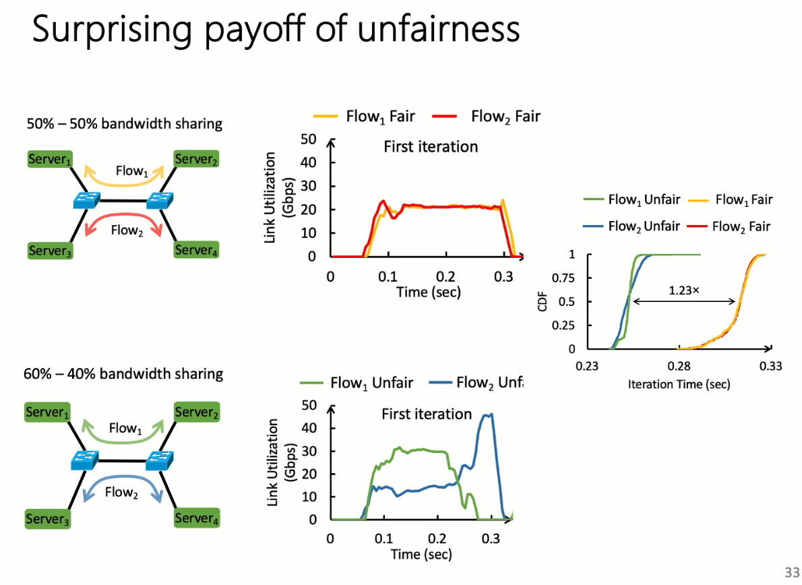

- When a job is given higher bandwidth, it will finish faster, and then it will start its next compute phase
- Then, the other job can use the full bandwidth, and then finish
- Then the job that was given higher bandwidth will finish its compute and start going again

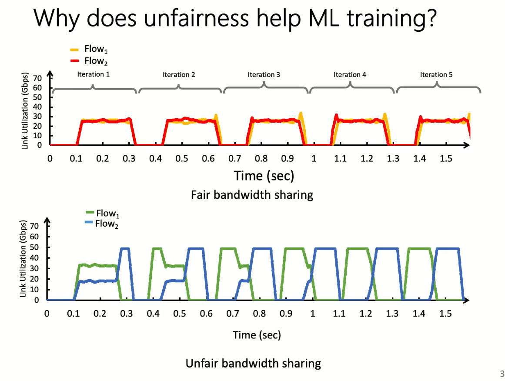

- How do we enforce unfair network usage?
  - We can't just tell them to only use 60% of the link rate because then when only one of them is using the link at a time, it will not use it up
  - We could use a priority queue to prioritize some over others
    - This adds more work for the switch to do
- We want to do something e2e
  - You could instead change the AIMD update rule of the windows
  - Have one add .6 and the other add .4
