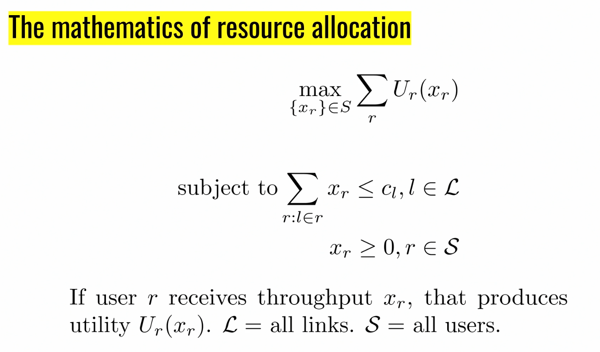
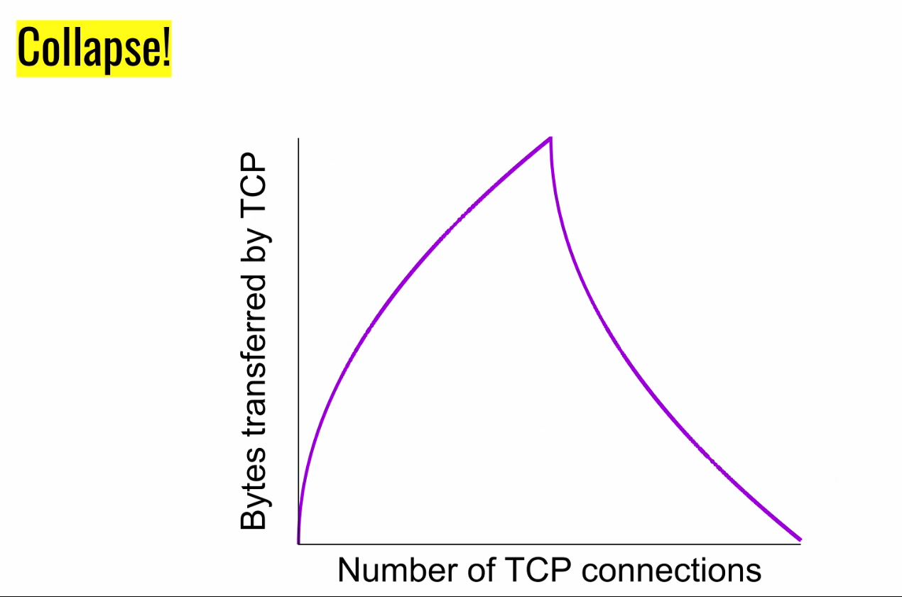

## Fairness

What are different ways of assigning throughput?

### Mathematics

**Alpha Fairness**

- We set $U(x) = \frac{x^{1-\alpha}}{1 - \alpha}$
- If:
  - $\alpha = 0$, we get max utilization
  - $\alpha \rightarrow 1$, we get proportional fairness
    - In the limit, thie becomes akin to some log of $x$
    - In this case, as I double my throughput, I get an increase of 1
    - If I double my resource allocation, then someone else cannot be worse than halved
  - $\alpha = 2$, we get min-potential-delay fairness
    - This becoems $-1/x$
    - $1/x$ is equivalent to time it takes to send a file
    - We say we are getting more pain for the longer it takes to send a file
  - $\alpha \rightarrow \infty$, we get max-min fairness
    - As the $\alpha$ becomes bigger, it becomes sharper so that any tiny decrease in the bottom is intolerable compared to any increase at the top
    - This essentially ensures that our min is as high as possible
- If one person can increase throughput without harming others, this is called a **Pareto-improvement**
  - We will not sacrifice Pareto optimality in any way, that is if we can take a Pareto-improvement, we will

### Congestion Collapse

- This occurs if there was work being sent to a receiver that was going to get there anyway
- Because the network is overloaded, the things build up and you get this collapse phenomenon

---

- We waste work when a receiver receives a packet twice
  - Otherwise, we will be chugging through work at a rate $C$ and we will finish everything eventually if the queue is always nonempty
- In a single link, with congestion control, thereis no way we could get a collapse as long as the loss adjudication is correct (which we assume it is, since that's not really about congestion control)
- The key about why we were able to get a collapse in the previous example was because $C$ was using up so much on the first link that is displacing useful work

### Another Example

## Mathematical Analysis

- We first started implementing TCP with AIMD without really knowing any of the mathematical properties behind it
- Years later, people started doing math and figuring out what kind of rough guarantees this gave us:
  
  - The second bullet point relates to thinking not just about long running flows, but also when you get flows entering and leaving the network randomly
  - They were only able to prove results about stability
- Starting in 2013, people started looking at congestion control as an RL problem wher people try to given a utility function, create a policy

## Incorporating Delay into Utility

- The utility for flow B should say 1000 instead of 0
- If each flow knows about each other, then:
  - A should take up all but 64 kbit / sec
  - B should just take that and not try to get more at all
- If they don't know about each other, then:
  - A cannot just keep sending until packet drops because then the queue will fill up and we will have bad delays for the other
- This problem becomes very hard once we start caring about delay
  - There is a big range of tradeoffs in throughput and delay

## More Fairness Models with Duration

- If we do the obviously "fair" thing with all of the previous notions of fairness, we will get half and half split
- If the link rate is 1 PB/s, then this will lead to $-40 - 39 = -78$
- However, if we just let $B$ go first, we would get $-19 - 39 = -58$
- We get this weird model where we should just focus on the shortest job first
