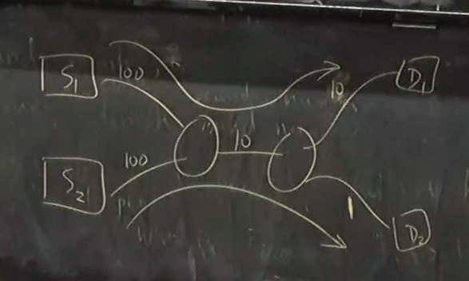

## Router Scheduling

- How do network providers figure out which packets to send to enforce things like how much people are paying bandwidth
- For the first part, we will talk about maximum fairness, which is a way of measuring fairness
  - Depending on the problem, we might use other kinds of fairness that we will talk about later
- Isolation:
  - If we all pay the same amount, it doesn't matter what other people do, we should all get the same amount if we are all offering load
- Two algorithms:
  - Fair queuing
  - Defecit round robin
    - This is simpler to implement but has less guarantees

## Fair Queueing

### Maximum Fairness

- Suppose we have $n$ customers, each offering a load of $a_1, a_2, \dots, a_n$ bits / sec
- The link capacity is $\mu$
- Suppose $\vec{a} = \{2, 3, 4, 5\}$ and $\mu = 10$
  - You could give everyone 2.5, but then you are not using up all of it
  - You could give everyone 10/14 of what they wanted, but then you don't have isolation
    - I.e. think about what hapens if the last person asks for 5000 instead
- Max min = of all possible allocations that add up to 10, give the one that makes the minimum the largest
  - After you remove the minimum, this property should still hold for everyone else
- An allocation method that satisfies this:
  - Take the min allocation and try to give it to everyone
  - Then subtract that from everone's and try it again
  - If there isn't enough to give it to everyone, equally distribute the remaining among everyone
- There are other allocations that satisfy this for maybe the smallest, but not once you apply this rule recursively

### Users

- How does a router determine what is a user?
  - They can do things like look at the destination address or source address (maybe look at port too)
- After doing this, they put all of a user's packets in a queue, and now we obly think about queues
- However, typically routers have a limited number of queues they can use
  - So they typically hash the user coming in to get which queue to put them in (stochastic fair queueing)
  - Easier to build fast hardware with a fixed number of queues

### Queues

- Queue with packets = backlogged queue
- Queue without = inactive / empty queue
- Round robin algorithm:
  - Start with the first queue, send its packet, and then go on
  - This doesn't consider packet sizes, which can vary from 40 bytes to 1500 bytes
  - Instead, we want to emulate a round robin that could send things bit by bit
    - This would implement maximum fairness since we are basically just doing what we described earlier
- Emulating bit by bit round robin:
  - We want to figure out which one bit by bit would have finished sending first
  - We keep this idea of a "round number" which is basically a virtual clock
  - Each packet will be assigned a start round number and an end round number
    - End round number = start round number + number of bits in the packet
    - When we get a new packet, we assign it with a start round number of:
      - Max of the previous packet in queue's finish round number and the current round number
  - We go through each of our queues and send the packet with the lowest finish round number
- An aside: using earliest start round number instead of finish round number is also an acceptable way of implementing fair queueing!
- Actually implementing this in hardware has a number of key points, but the main idea is that there is work done to make it faster by keeping approximate round numbers

### Guarantees

- Delay Bound:
  - Assume we have a $(\sigma, \rho)$ source of data:
    - This means that in any duration $\tau$, the number of bits sent to us is at most $\sigma \tau + \rho$
    - Idea is that this is the maximum consistent rate coming in, but we allow for some burst
    - This is known as a **token-bucket** specification
  - Under this assumption, there is a theorem that gives a guarantee on the delay for a specific packet

### End to End Congestion Control

- If every router does this, do we still need e2e?
- It is worth using the e2e so that you can adapt to the current network conditions
  - Otherwise if you just keep sending too much then you will just get drops upon drops
- Even beyond this, you actually need e2e congestion control to run entworks with maximum efficiency
  - Suppose we had S1 sending to D1 and S2 sending to D2 along the same link
    
  - The correct answer would be to allocate 9 to S1 and 1 to S2
  - However the fair queueing alone would just give you 5 and 5 for both sources

## Defecit Round Robin

- Attempts to get rid of some of the difficulties of implementation
- Fair queuing has a very rigid way of defining excactly the order packets are sent in
  - This allows us to develop delay bounds
- We attempt to relax that to ease implementation
  - Provides no delay guarantee, only bandwidth guarantees
- Each of your active queues will "accumualate credits"
  - Each timestep, accumulate total bandwidth / number of active queues
  - We then look at which queue has enough accumulated credits to send the next packet in its queue
  - If it is, send the packet and decrease the accumulated credits
-
