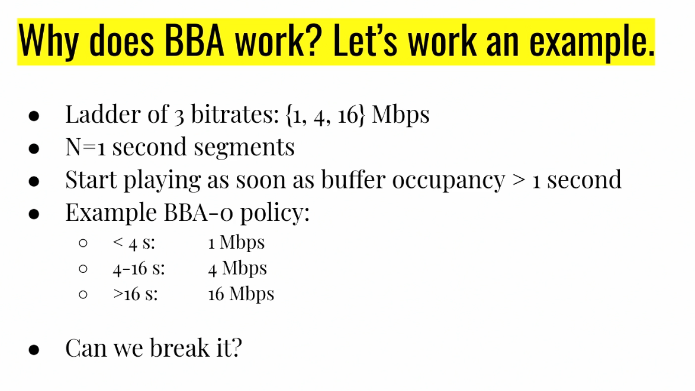
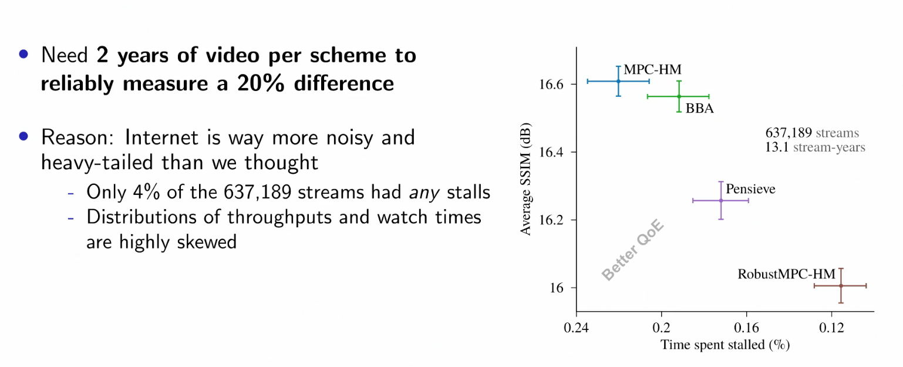
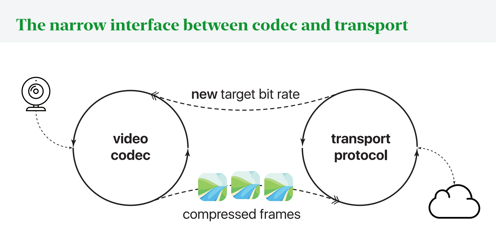

## Video Streaming

- Over 3/4 of bits send over the Internet are video
- In early days, sending uncompressed video would be way too much (740 megabits per second when we could only do like 20)
- **Intra-frame compression**:
  - Compressing an image only relative to itself
  - Divide component into blocks (i.e. 8x8)
  - For each channel of each component, predict from surrounding blocks what this component is
  - Take the residue (what's left / not predicted) and transform it (i.e. some change of basis)
  - Then quantize this to throw away some higher level information but keep the general picture
  - Then use some compression algorithm to transmit this (i.e. Huffman codes)
- **Inter-frame compression**
  - Divide frame into macroblocks
  - For each macroblock, encode with either the intra-frame compression discussed before
  - Or predict by shifting / warping part of a reference frame and then compressing the residue
  - The resulting frame can be either displayed and/or stored as a reference frame for future compression
  - The reference frame could be from the future or past
- A macroblock can be labeled as:
  - I: from intra-frame
  - P: predicted from past
  - B: bilteral prediction from the future

### Bitrate

- What is bitrate?
- Problem: it is no longer predictable how many bits each frame will consume
  - In the best case, we have a single frame that takes some kb and then everything else is 0
  - Or in the worst case, everything requires the same amount of kb to display the entire image
- Target decoder model:
  - We have a buffer that is filling with information at some constant network speed
    - Buffer occupancy can be measured in either bytes or seconds
  - In "random" spurts, it is decreasing as we take frames out of the buffer
- What it means for a video to have a certain bitrate is:
  - If bytes stream in at that rate and the buffer has a certain max occupancy and the video starts playing when the buffer reaches a certain occupancy, then the video can play without interruption and without the buffer ever filling up
  - This means that saying a video has a certain bitrate means you have to provide three numbers:
    - The bitrate
    - Buffer maximum size
    - Initial playback delay
- How can we reduce required bitrate?
  - Can make it look worse (reduce quality) by reducing picture quality or framerate

### Playback

- When can you start playing frames?
- If every frame was the same size, you could just wait until you got a single frame
  - Or you could just wait until your buffer filled
  - You could also do some backwards computation to figure it out
- Services like YouTube offer multiple possible bitrates
- How does this make the choice automatically?
  - Segmented streaming with bitrate adaptation (around the 2008 Olympics)
  - We divide the video into independent segments
    - Between segments, no inter-frame prediction
  - This means that at every segment, there is a decision opportunity for what bitrate to get this segment at
  - At each segment, we use an ABR policy to choose the appropriate bitrate
    - The first policies estimated throughput then picked the highest feasible
    - This is done client-side

However, choosing bitrate based on throughput has problems:

- Estimating current throughput is challenging
  - When using TCP, if there is a missing packet, the application will only see up to that hole, even if in reality you are getting many many packetes beyond that hole
    - Therefrom the application layer, they can't really see what the throughput is
- Future throughput is even moreso
  - Video streaming clients experience highly variable e2e throughput

### Buffer Occupancy Based Playback

In 2013, a new KISS idea came out: base it all on buffer occupancy

- If the buffer occupancy is low, use a low quality
- If it is high, use a higher quality

---

- Main idea: if our throughput is enough to sustain a certain bitrate, then we will be able to download faster than we consume and be able to stay in these certain ranges
- Why did this specific example work?
  - The minimum speed we really care about is the 1Mb/s because that's the lowest bitrate we offer
  - Using that as the minimum, this basically just says that if we go over 16s and switch to 16 Mb/s, then even if we drop down to the lowest bitrate, we will still ahve enough buffer to download the next chunk before the buffer runs out
    - And then we can switch over to the lower bitrate because we ran out of buffer

### "Optimal" Streaming Algorithms

- After this came out, researchers started adding more parameters alongside the buffer occupancy
  - They started using models to predict the future download time and got an objective function that they could optimize for minimizing quality variation / stalls
  - They also tried online reinforcement learning
- They outperformed the simple buffer occupancy algorithm but when they attempted to replicate it in real world settings:
  - The same held here: the "dumb" BBA scheme just outperformed
    
  - To get this data, Stanford created a website that rebroadcasts free TV and people can watch online
    - They vary the algorithms used for people and measure a lot of data
- There was one thing called Fugu that did end up becoming better
  - Uses a lot of ML sophistication and has to use training data (i.e. from the previous day on the same website) to make predictions on transmission time

## Real Time Video

- Typically, the video codec and actual transport (TCP) logic are separate
  - Can think of it as two different control loops that are running in parallel
  - The codec sends compressed frames to the transport, and the transport sends a new target bit rate back to the codec
    
- As a result, it is hard for the video codec to integrate well with the transport logic
- Improving one at a time can help, but can still lead to issues since the codec can't know the TCP
  - I.e. if you have a large frame to send, and it causes the TCP window to expand, this might cause the buffer to overflow, and then the TCP drops again and you can't send the smaller frames now
- Salsify:
  - Idea is you can encode the idea of skipping frames so that right before sending a frame, you ask the TCP transport layer if there is enough space to send this, and if there isn't, then you can choose to skip a frame and not send
    - Avoids overwhelming the TCP queues / congestion windows
  - The other key idea behind this is that when encoding, you encode two versions, one a higher quality version and one a lower quality version and you ask the transport layer which of these can fit (if any) and use that to inform your decision
