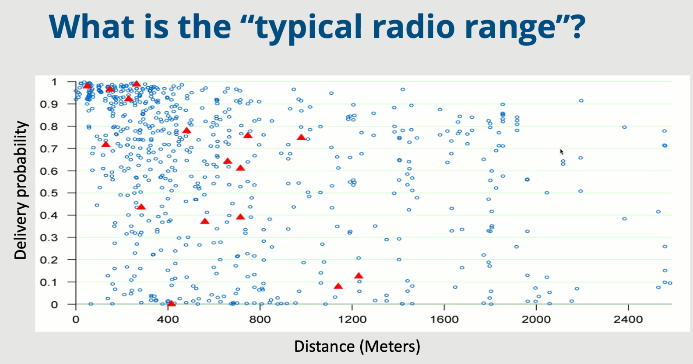
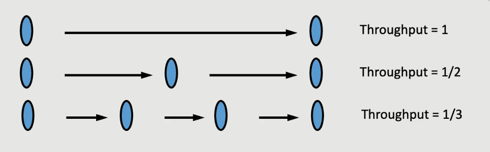
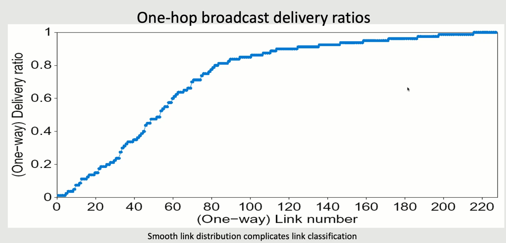
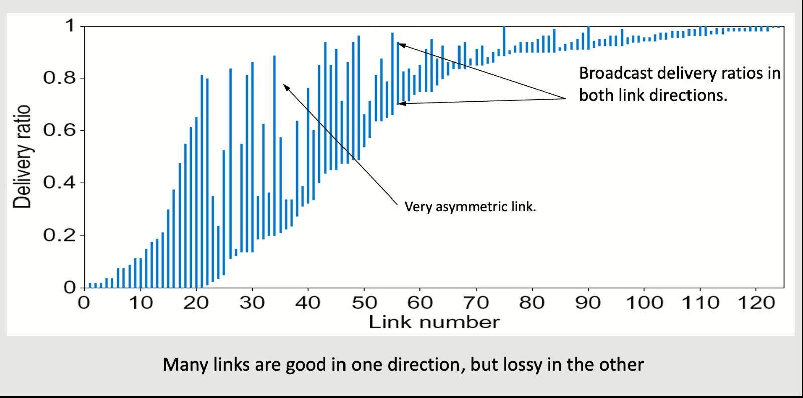

## Wireless Networks

### Differences Between Wired

- Wireless has interference with different communication channels
  - In wired, you just have these shielded cables that are only mixed once you get to a router / switch
- Both wireless and wired have noise, but the type of noise is different
- Broadcasting is easier than wired because you can just send a message once versus 10 times
  - Fundamental difference: shared medium
- The distance between the sender and receiver can change constantly during wireless
  - This changes the noise / conditions / the signal strength

---

- Two main things that guide the architecture of the system:
  - Adapting to different conditions
  - Sharing a medium
- In the electromagnetic spectrum, the amount of the spectrum is a scarce resource
  - Some of it is iicesnsed by things like the FCC in the US
  - Some of it is unlicensed like WiFi

### Celllular

- We divide the world into cells
- Each cell has a base station responsible for covering that cell
  - Each is connected to a wired network via backhaul links
- Neighboring cells get allocated different frequencies
  - I.e. each will have a specific channel number, each of which is allocated a different i.e. 5 MHz part of the spectrum
  - There is a lot of flexibility in how much you allocate
- In WiFi, these are known as access points instead

### Time Multiplexing

- We need to somehow figure out when each person is going to communicate
  - We can't have everyone shouting at once since they will all interfere with each other
  - We divide time into segments where only one person gets to talk
  - There are ways to get multiple people to talk at the same time but to a limited sense
- Someone has to decide when each device gets to speak
  - The base station knows when it has data, but not when any of its users have data to send
  - We don't want to waste time
- We could all try sending data
  - If we don't get an acknowledgement due to the interference, we set a random timeout and try again
- This was first done in the Aloha network which connected islands in Hawaii via a satellite backhaul link
- Some ideas for improving:
  - Dividing time into slots restricting to sending messages at the beginning of a time slot doubles the capacity of a network
    - Idea is that if two people were going to collide, you might as well collide fully by aligning the time slots
    - Network capacity utilization doubles from 1/2e to 1/e
  - Carrier sense:
    - Listen for a random amount of time (a contention window) before you transmit
      - If we see that the network is being used, you should back off exponentially and double the amount of time you wait before trying again
      - We should only count down when the channel is free
    - In total, this gives around 90% utilization empirically
- Unfortunately it isn't always possible to tell when a channel is free, so we still need acknowledgements
  - I.e. a case of hidden terminals where two peoplea are on opposite sides of the same cell and can talk to the base station, but not each other
- Exposed terminal problem is when S1 wants to send to R1 and S2 wants to send to R2 but S1 and S2 are next to each other
  - We could have both send successfully if R1 and R2 are far from each other
  - But carrier sense prevents this
  - We lose a bit of throughput, but in reality we don't care about this
    - The acknowledgements for these messages might have collided with each other so it is fine to not send this

### Time Division Duplex

- We have a controller node that is controlling peripherals
- We split into time segments
  - Every odd segment is the controller broadcasting to a specific device
  - Then that device will respond
- Wastes some time because if I want to get data from someone, then I have to send them a fake packet and then get their response
  - Or I want to send to you and you have nothing to send back to me
  - Under high load, this works
    - For bluetooth, this often works well
    - Especially for bluetooth audio, which is periodic, so the controller can allocate timeslots accordingly

## Adapting to Variability in Rates

- We want to extract the highest possible rate we can transfer at
- Modulation and coding scheme (MCS):
  - Idea is that when transmitting data, we need to specify a modulation type and coding rate
  - Modulation type: phase and amplitude modulation for transmitting bits
    - Idea is that each combination of phase / amplitude will convey some bits
    - I.e. we take the phase amplitude plane and we break it down into 16 regions, each of which corresponds to some sequence of 4 bits
    - When we get a signal, we look at what is the closest region and use that to get the bits out
    - Examples: QAM-16
  - Coding rate: how much of our bits is going to be used for the error correction
    - Higher values transfer more information but sacrifice reliability
- We need to have some policy for determining the MCS
  - Previously, people were trying things similar to congestion control
  - If a packet didn't get through, send it again at a lower speed
  - Problem is that if it didn't get through because of a collision, and now you send it with 1/2 the speed, it now takes twice as long
    - There is an even higher chance of collision now
    - We don't have the same kind of problem now because this is a very collision heavy network
- Instead, an extremely simple idea was to just try a bunch of different bitrates carefully and choose which leads to the lowest time to transmit

## Scheduling

- The scheduling problem is different here as well since different clients will have different link rates
- Before, we were concerned with the bottleneck link rate
- Now, we want to send more data to the people with the higher link rates
  - So spending time equally among the people is a way to achieve proportional fairness
- This algorithm for achieving roughly proportional fairness is used almost everywhere:
  - For each person, the base station computes the instantaneous rate to them and maintains an exponential moving average
  - At each time step, select the user with the maximum instantaneous rate divided by average rate
  - Idea is that for users who didn't get serviced in the time slot, the rate sent to them at that point was 0 so the average will come down a bit
    - It will be multiplied by $1 - \alpha$
    - Typically, $\alpha$ will have to be set to with respect to the number of users to make sure everyone gets a chance
- Why does this give proportional fairness?
  - Proportional fairness tries to maximize $U = \sum \log R_\text{avg}^i$
  - $\pfrac{U}{R_{avg}^i} = 1 / R_{avg}^i$
  - $\Delta U = \sum \pfrac{U}{R_{avg}^i} \cdot \Delta R_{avg}^i$
    - But $\Delta R_{avg}^i = R_{avg}^i(t) - R_{avg}^i(t - 1)$
  - Substituting this and the definition for the average in with respect to the instantaneous tells us that we can maximize the change in $\Delta U$ by adjusting the average of the person who has the maximal value of instantaneous / average

## Roofnet

- The idea was for an apartment building, you didn't need every apartment to have their own router
- You could instead just have wide coverage from just a few nodes on the roof of the apartment building, each of which could serve 10-30 people
- So this is an example of a home-esque network that is entirely handled through wireless with no wired backbone
- Source routing: rather than use something like BGP or distance-vector, the sources all determine the path the packet is going to take

  - Things are changing all of the time in terms of link rates and topology so people foundm with a distributed system things would get caught in a loop
  - We need to force the source to make a decision and avoid these cycles
  - If it gets lost, we just let it get lost
  - Each source figures out a path through link state: - Each node gets a view of the entire graph and shares it with neighbors to build this - This is only possible with a small number of nodes, which works here - This can be maintained in a wireless network by a node just broadcasting a signel, and all nodes could read that and use it to estimate the quality - General rule of thumb: if there is a lot of dynamic things that are changing in the network, do source routing

- 
  - This is all over the place because it largely depends on what is going on near the receiver

### Route Metric

Link metric: How do we figure out which path to use?

- One key: multiple hops reduce throughput
- Links share the radio spectrum, so an intermediary node cannot listen while talking
- Therefore, to retransmit what I want, it has to multiplex between listening and sending, and cuts the throughput in half
  
- Could avoid this by talking on different frequencies, but then we have even more challenges of assigning frequencies, etc.
- Also: many links are asymmetric and links are very varying in their delivery ratio
  
  - Makes it hard to just give a threshold to say whether some links are bad or not
    
- One metric is ETX (expected transmission count)
  - Minimize the total transmissions per packet by looking at delivery ratios
  - For a path of multiple links, the total ETX is the sum of all component ETCs
