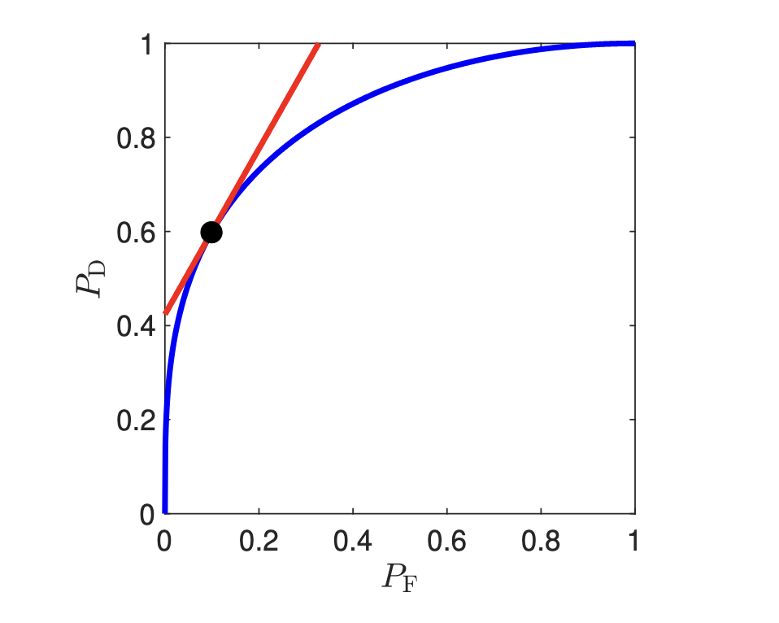

## NonBayesian Hypothesis Testing

Previously, we looked at a Baeysian approach where we had a _a priori_ probability distribution and cost criterion to determine $\eta$

- We computed the likelihood ratio $\frac{p_{y|\mc{H}}(y|H_1)}{p_{y|\mc{H}}(y|H_0)}$
- However, it is not quite clear how to choose this
- The threshold $\eta$ can be quite sensitive to these choices
- We'll go over another way to decide between hypotheses

### Classification Performance Measures

The performance of any decision rule can be fully specified by two quantities:

$$
\begin{align*}
P_F &= P(\hat{H} = H_1 | H = H_0) \\
P_D &= P(\hat{H} = H_1 | H = H_1) \\
\end{align*}
$$

- $P_F$ is th false-alarm probability
- $P_D$ is the detection probability

These have other names in other disciplines

- Statistics: $P_F$ is the size and $P_D$ is the power
- Type I error: $P_F$
- Type II error: $1 - P_D$
- Machine learning: $P_D$ is the recall / sensitivity
  - Use $P_P = P(H = H_1 | \hat{H} = H_1)$ as the precision / positive predictive value (PPV)
  - This does depend on the choice of priors, but given a fixed set of these priors, it is a function of $P_F$

### Operating Characteristic of the Likelihood Ratio Test

In general, a good decision rule has a large $P_D$ and a small $P_F$

- However, these are competing objectives
- If we use a likelihood ratio test, then each choice of $\eta$ uniquely determines a decision rule with some $(P_F(\eta), P_D(\eta))$
- We can trace this point as $\eta$ varies in $[0, \infty)$ to get the **OC-LRT**, also known as the **ROC (receiver operating characteristic)**

In general, we have that:

- As $\eta \rightarrow 0$, we approach $(1, 1)$
- As $\eta \rightarrow \infty$, we approach $(0, 0)$

#### Bayesian Operating Point

The Bayesian test corresponds to a specific $\eta$, which means it is a point on the curve

To get this, we note the Bayes risk is of the form:
$$\phi(\hat{H}) = \sum_{i,j} C_{ij} P(\hat{H} = H_i | H = H_j)P_j$$

This corresponds to:

$$
\begin{align*}
\phi(\hat{H}) &= \alpha P_F - \beta P_D + \gamma \\
\phi(\hat{H}) &= (C_{10} - C_{00})P_0 \cdot P_F - (C_{01} - C_{11})P_1 \cdot P_D + C_{00}P_0 + C_{01}P_1
\end{align*}
$$

For any constant $c$, setting $\phi(f) = c$ yields a line:
$$P_D = \frac{\alpha}{\beta}P_F + \gamma - c$$

In this case, $\frac{\alpha}{\beta}$ is equal to the threshold $\eta_B$ in the Bayesian test

- Therefore, the Bayesian test is finding the smallest $c$ that leads to an intersection of the line with slope $\eta_B$ and the OC-LRT
- Since the y-intercept contains a $-c$, this means that smaller $c$ raise the line upwards
- This means we are looking for the highest line with slope $\eta_B$ that still intersects the OC-LRT

||theorem Monotonically Nondecreasing
The OC-LRT is monotonically nondecreasing
||

- This can be proven by considering that if you increase $\eta$ such that $P_F$ changes, then $P_D$ and $P_F$ cannot increase by looking at the definitions

### Neyman-Pearson Hypothesis Testing

When we are unable / it is difficult to choose costs for a decision problem, one popular alternative is:

- Choose a decision rule that maximizes $P_D$
- Subject to $P_F \leq \alpha$ for some $\alpha$ of choice

||theorem Neyman-Pearson Lemma
Suppose the likelihood ratio $L(y)$ is a purely continuous random variable under each hypothesis. Then a solution to the above among the deterministic estimates is an LRT test with $\eta$ chosen such that:
$$P_F = \alpha$$
||

What this implies is we can just look at the OC-LRT and draw the line $P_F \ alpha$ to find the $P_D$ value

This theorem is quite restricting in that it:

- Requires the likelihood ratio is continuous, which is not true if either hypothesis uses a discrete distribution or if there is a strange interaction
- Only looks at deterministic decision rules

**Proof Sketch**:

- We look at any test with $P_D, P_F$ as well as a specific test under a LRT with threshold $\eta$ with $P_D^\eta, P_F^\eta$
- We can do some algebra to find that:
  $$P_D^\eta - P_D \geq P_F^\eta - P_F$$
- As a result, if $\eta$ is chosen such that $P_F \leq P_F^\eta$, then $P_D^\eta \geq P_D$
- If $\eta$ is chosen such that $P_F^\eta = \alpha$, then any other test with $P_F \leq \alpha$ will have $P_D \leq P_D^\eta$, and therefore is not better

### P-Value

The LRT rule $L(y) \geq \eta$ can have a monotonic $g(\cdot)$ applied to both sides:
$$g(L(y)) \geq g(\eta)$$

We can do this with $P_F$, which gives:
$$P_F(L(y)) \leq P_F(\eta)$$

- We take $p_*(y) = P_F(L(y))$ and $P_F(\eta) = \alpha$
- This is known as the p-value and the significance level of the test
